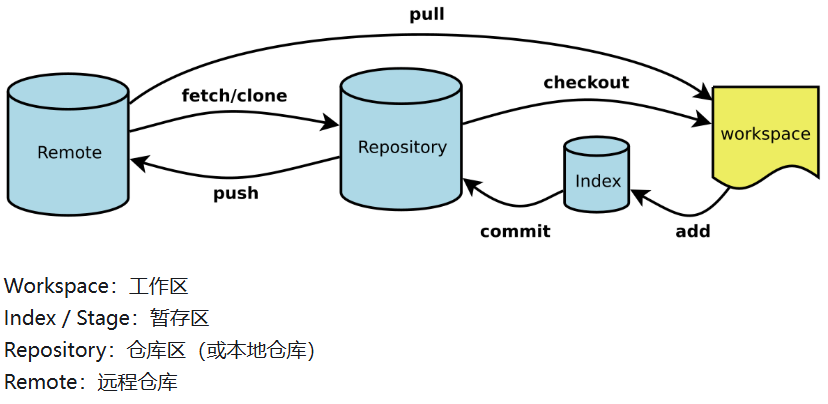

## Git

## Git简介和基础概念

- 分布式版本控制系统：用于高效管理项目版本。
- 与SVN(集中式版本控制系统)区别 ：
  - 分布式架构（无需中央服务器）
  - 轻量级分支模型
  - 元数据存储方式

## 基础配置

```bash
git config --global user.name "YourName"
git config --global user.email "email@example.com"
git config --global core.editor "code --wait"  # 设置默认编辑器
```

## 核心工作流程



### 仓库操作

- 初始化：`git init`
- 克隆仓库：`git clone <url>`
- 文件状态管理：
  ```bash
  git add <file>      # 添加到暂存区，常用git add .，此处.意为全部文件
  git commit -m "msg" # 提交到版本库，-m后为注释信息
  git status          # 查看状态
  git diff            # 查看差异
  ```

### 分支管理

| 功能     | 命令                       |
| -------- | -------------------------- |
| 创建分支 | `git branch <name>`      |
| 切换分支 | `git checkout <branch>`  |
| 合并分支 | `git merge <branch>`     |
| 删除分支 | `git branch -d <branch>` |

- 冲突解决：手动编辑冲突文件，`git add`，`git commit`。
- `git merge`时默认情况Git会执行"快进式合并"（fast-farward merge），会直接将Master分支指向Develop分支。此时需要使用 `--no-ff`参数在Master分支上生成一个新节点。
- 除了版本库的两条主要分支Master和Develop外还有一些临时性分支，用于应对一些特定目的的版本开发。临时性分支主要有三种：功能（feature）分支、预发布（release）分支和修补bug（fixbug）分支。这三种分支都属于临时性需要，使用完以后，应该删除，使得代码库的常设分支始终只有Master和Develop。

### 历史查看

```
git log --oneline --graph  # 简洁图形化日志
git blame <file>          # 查看文件修改历史
```

### 远程协作

#### github集成

1. SSH密钥配置

```
   ssh-keygen -t rsa -C "email@example.com"
   cat ~/.ssh/id_rsa.pub → 添加到GitHub
```

1. 远程仓库操作

```
   git remote add origin <url>  # 添加远程仓库
   git push -u origin main      # 首次推送
   git pull origin main         # 获取更新
```

### 高级操作

#### 代码暂存与恢复

```
git stash        # 暂存当前修改
git stash pop    # 恢复最近暂存内容
```

#### 版本回退

```
git reset --soft HEAD~1  # 撤销提交保留修改
git reset --hard HEAD~3  # 彻底回退到前3个版本
git revert <commit>      # 创建逆向提交
```

### 代码重组

```
git rebase -i HEAD~3     # 交互式变基
git cherry-pick <commit> # 选择性应用提交
```

### 常见的问题

当本地分支名（master）和远程分支名（main）不同时，会导致以后每次都要指定 `origin main`，即 `git pull --rebase origin main`。

所以推荐统一分支名：

```bash
# 本地分支改名为 main（推荐，与远程一致）
git branch -m master main
git branch -u origin/main main

# 以后直接
git pull --rebase
git push
```

其次，https连接通常会不稳定，建议**彻底改用 SSH 协议。**

正常指定仓库远程地址：`git remote add origin https://github.com/XXXXXX/xxxxx.git`

如果需要修改则使用：`git remote set-url origin git@github.com:XXXXXX/XXXXXX.git`

如果需要测试网络连接则使用：

```bash
# 测试 SSH 连接
ssh -T git@github.com
# 应返回：Hi yzxxqwq! You've successfully authenticated...
```
