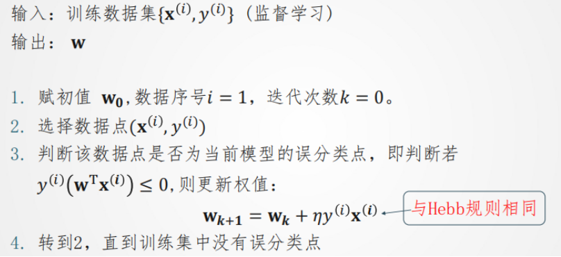
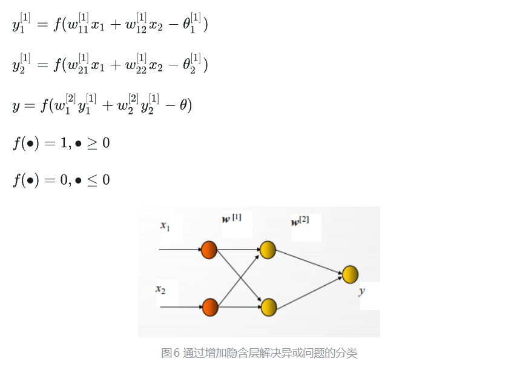
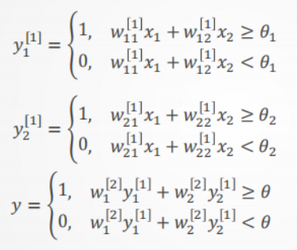
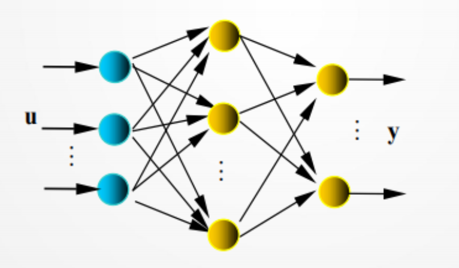

## 线性分类问题与线性不可分问题

线性分类的定义如下：线性分类是一种机器学习算法，指线性分类器通过对样本数据的特征的线性组合来做出分类决定，将数据分为两个类别，以达到此种目的。简言之，样本通过直线(或超平面)是可分的。

无法用线性分类器实现的分类问题即为线性不可分问题。

线性不可分问题例如Minsky在1969年提出XOR（异或）问题。

## 多层感知机

感知机(Perceptron)是1957年，由Rosenblatt提出，是神经网络和支持向量机的基础。通过感知机可以解决线性分类问题。在二维情况下分割两组数据集的直线方程为：$ax+by+c=0$,假设在平面内任一点的坐标为$w(x_0,y_0)$,到直线的距离为$d=\frac{ax_0+by_0+c}{\sqrt{a^2+b^2}}$,如果是高维情况，分类面为超平面，则有：$d=\frac{w^Tx}{\Vert x\Vert}$,其中$w_0=b$,感知机从输入到输出的模型如下：$y=f(x)=sign(w^Tx)$,其中sign为符号函数当x小于0时取-1,当x大于等于0时取1.

定义损失函数:$L(w)=- \frac{1}{\Vert w\Vert}\sum{y^{(i)}(w^Tx^{(i)})}$

通过训练感知机实现对数据集的线性分类的步骤如下：



## 通过多层感知机解决线性不可分问题

对于线性不可分问题，在输入和输出层间加一或多层隐单元，构成多层感知器（多层前馈神经网络）。加一层隐节点（单元）为三层网络，可解决异或（XOR）问题由输入得到两个隐节点、一个输出层节点的输出：



从而可以得到:



三层感知器可识别任一凸多边形或无界的凸区域。更多层感知器网络，可识别更为复杂的图形。

对于多层感知器网络，有如下定理：

（1）若隐层节点（单元）可任意设置，用三层阈值节点的网络，可以实现任意的二值逻辑函数。

（2）若隐层节点（单元）可任意设置，用三层S型非线性特性节点的网络，可以一致逼近紧集上的连续函数或按 范数逼近紧集上的平方可积函数。

## 多层前馈网络及BP算法

多层感知机是一种 **多层前馈网络，** 由多层神经网络构成，每层网络将输出传递给下一层网络。神经元间的权值连接仅出现在相邻层之间，不出现在其他位置。如果每一个神经元都连接到上一层的所有神经元（除输入层外），则成为 **全连接网络** 。下面讨论的都是此类网络。

多层前馈网络的反向传播 （BP）学习算法，简称BP算法，是有导师的学习，它是梯度下降法在多层前馈网中的应用。网络结构：见图所示 ,是网络的输入、输出向量，神经元用节点表示，网络由输入层、隐层和输出层节点组成，隐层可一层，也可多层（图中是单隐层），前层至后层节点通过权联接。由于用BP学习算法，所以常称BP神经网络。



已知网络的输入/输出样本，即导师信号 ，BP学习算法由正向传播和反向传播组成：

① 正向传播是输入信号从输入层经隐层，传向输出层，若输出层得到了期望的输出，

则学习算法结束；否则，转至反向传播。

② 反向传播是将误差(样本输出与网络输出之差）按原联接通路反向计算，由梯度下降法调整各层节点的权值和阈值，使误差减小。

## 多层感知机的python实现

```
import torch
from torch import nn
from d2l import torch as d2l
batch_size = 256
train_iter, test_iter = d2l.load_data_fashion_mnist(batch_size)


num_inputs, num_outputs, num_hiddens = 784, 10, 256
W1 = nn.Parameter(torch.randn(
num_inputs, num_hiddens, requires_grad=True) * 0.01)
b1 = nn.Parameter(torch.zeros(num_hiddens, requires_grad=True))
W2 = nn.Parameter(torch.randn(
num_hiddens, num_outputs, requires_grad=True) * 0.01)
b2 = nn.Parameter(torch.zeros(num_outputs, requires_grad=True))
params = [W1, b1, W2, b2]

def relu(X):
 a=torch.zeros_like(X)
 return torch.max(X, a)

def net(X):
 X = X.reshape((-1, num_inputs))
 H = relu(X@W1 + b1) # 这里“@”代表矩阵乘法
 return (H@W2 + b2)


loss = nn.CrossEntropyLoss(reduction='none')

num_epochs, lr = 10, 0.1
updater = torch.optim.SGD(params, lr=lr)
d2l.train_ch3(net, train_iter, test_iter, loss, num_epochs, updater)

d2l.predict_ch3(net, test_iter)
d2l.plt.show()
```
