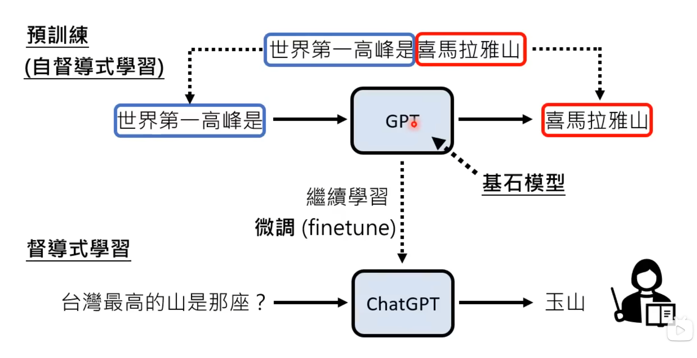
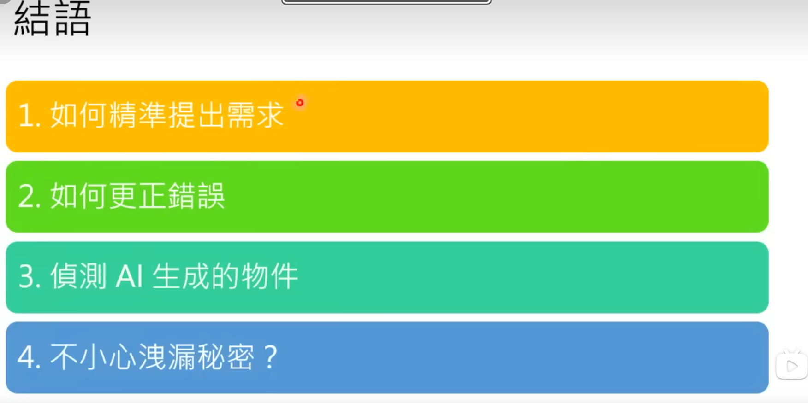
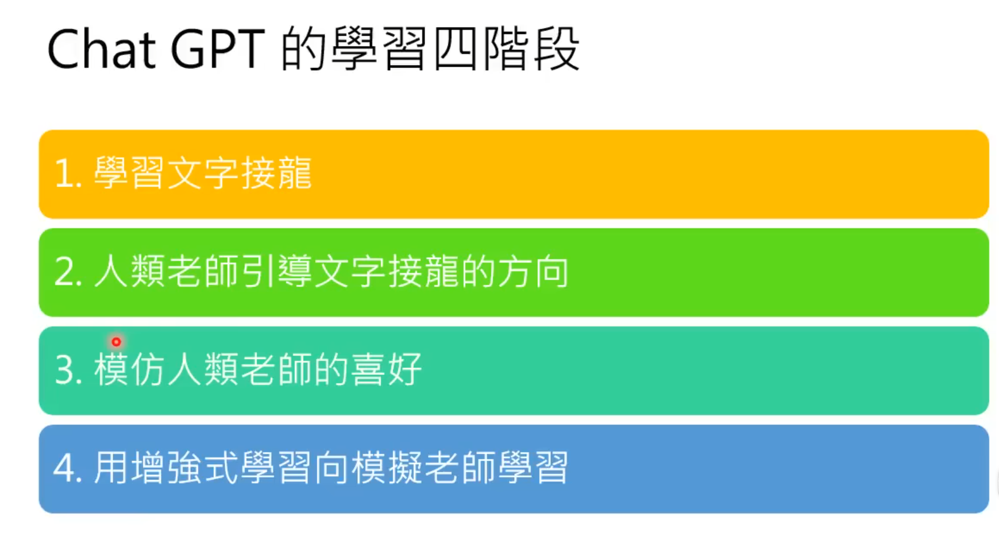
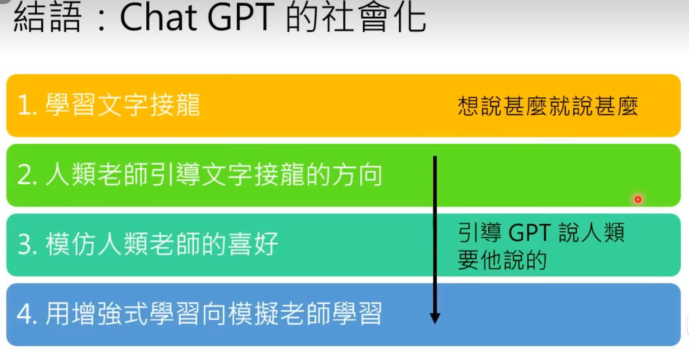
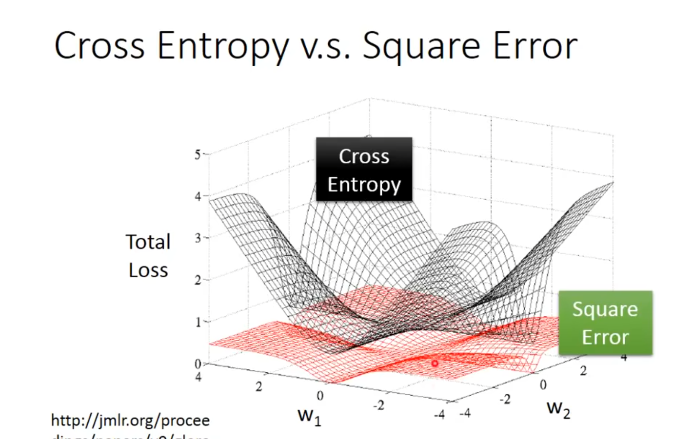

## Chatgpt原理剖析

2022年12月7日上传

真正做的事——文字接龙

### Chat-gpt背后的关键技术——预训练

### chatgpt所引出的研究问题

### chatgpt学习四个阶段

## Regression

Regression 就是找到一个函数 function，通过输入特征 x ，输出一个数值 **Scalar** 。

### 实现回归的步骤

1. model（确定一个模型）——线性模型
2. goodness of function（确定评价函数）——损失函数
3. best function（找出最好的一个函数）——梯度下降法
   梯度：在单变量的函数中，梯度其实就是函数的微分，代表着函数在某个给定点的切线的斜率。多变量函数中，梯度是一个向量，向量有方向，梯度的方向就指出了函数在给定点的上升最快的方向

### 如何使得回归效果更好

1. select another model（选择另一个模型）
2. consider the hidden factors（考虑其他隐藏因素）

## Classification

分类，即在一个函数判断输入数据所属类别，包括二分类（是/否）和多分类（类别1/类别2……）。

分类问题是在“定义函数集合 → 评估函数好坏 → 挑选最优函数”这一框架在离散标签预测场景下的具体应用，与回归问题（连续值预测）形成鲜明对比。

[李宏毅机器学习笔记1——classification（分类）_李宏毅classification课程笔记-CSDN博客](https://blog.csdn.net/m0_63776870/article/details/133778808)

[「李宏毅机器学习」学习笔记-Classification：Probabilistic Generative Model | BlueCode](https://blueschang.github.io/2018/11/02/%E3%80%8C%E6%9D%8E%E5%AE%8F%E6%AF%85%E6%9C%BA%E5%99%A8%E5%AD%A6%E4%B9%A0%E3%80%8D%E5%AD%A6%E4%B9%A0%E7%AC%94%E8%AE%B0-Classification/)

通过逻辑回归的局限性自然引出深度学习的动机：

逻辑回归是线性分类器，无法处理非线性可分数据。解决方案：对特征进行非线性变换。

手动设计特征变换困难。解决方案：让机器自动学习变换：堆叠多个逻辑回归单元。

单个"神经元"能力有限。解决方案：多层网络（Deep Neural Network）。

这一推导过程揭示了 **神经网络的本质：多层逻辑回归的堆叠** ，每个神经元执行"线性变换 + 非线性激活"的操作。

## Logistic Regression

简单来说：**Logistic Regression = 线性模型 + Sigmoid 压缩 + 交叉熵损失。**

 **核心矛盾** ：分类需要输出 **概率** （**[**0**,**1**]** ），但线性模型 **z**=**w**⋅**x**+**b**  的输出范围是 **(**−**∞**,**+**∞**)** 。

 **解决方案** ：引入一个"压缩函数"，将线性输出映射到 **(**0**,**1**)** 。

模型架构：Sigmoid 函数。

损失函数：用交叉熵（Cross-Entropy）。分类问题 **绝对不能用 MSE** ，必须使用交叉熵。

从二分类到多分类：使用Softmax，**K**=**2**  时，Softmax 等价于 Sigmoid。
