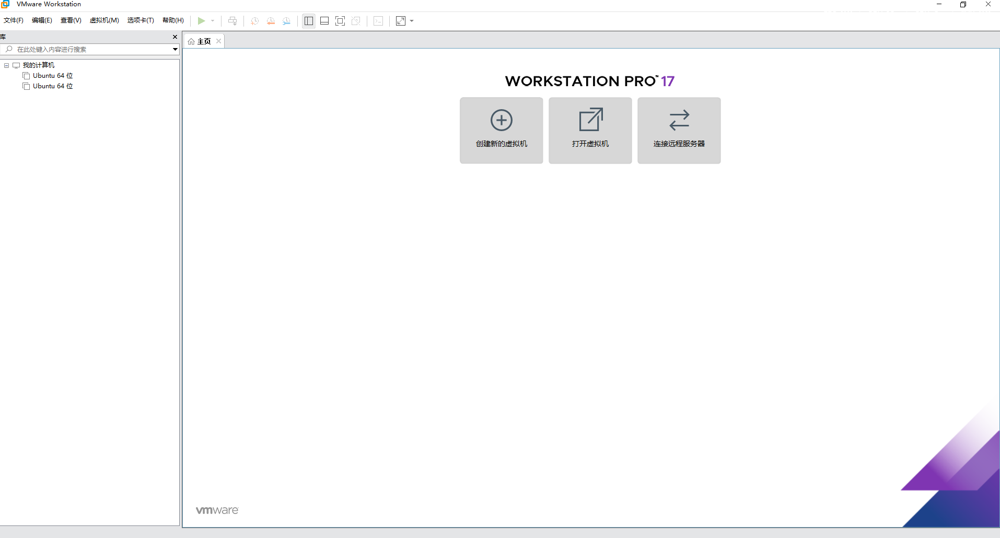
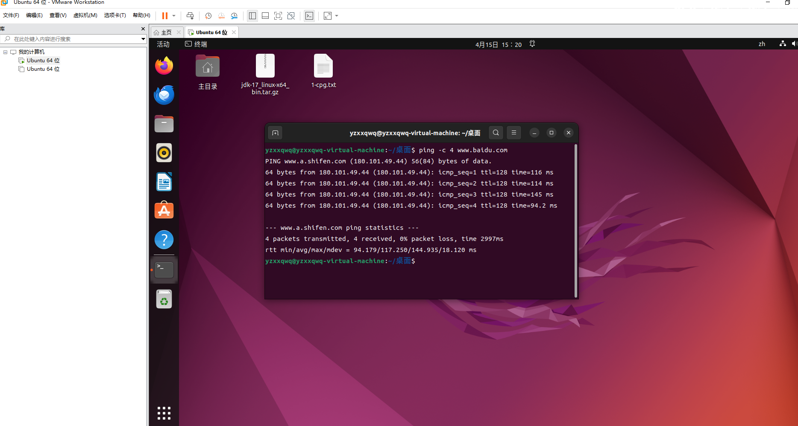
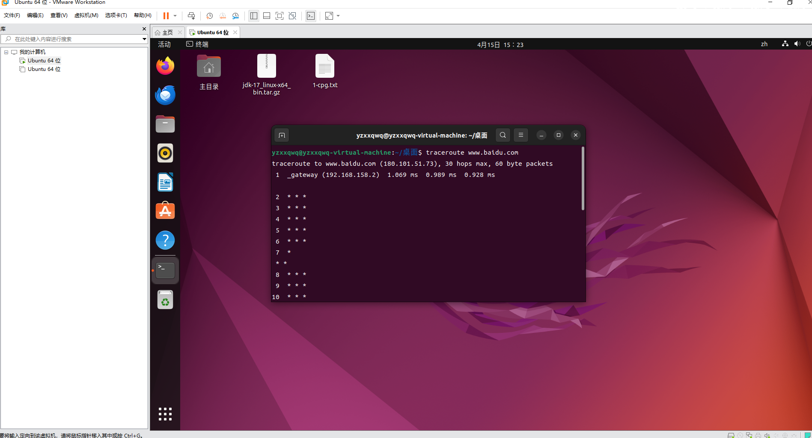
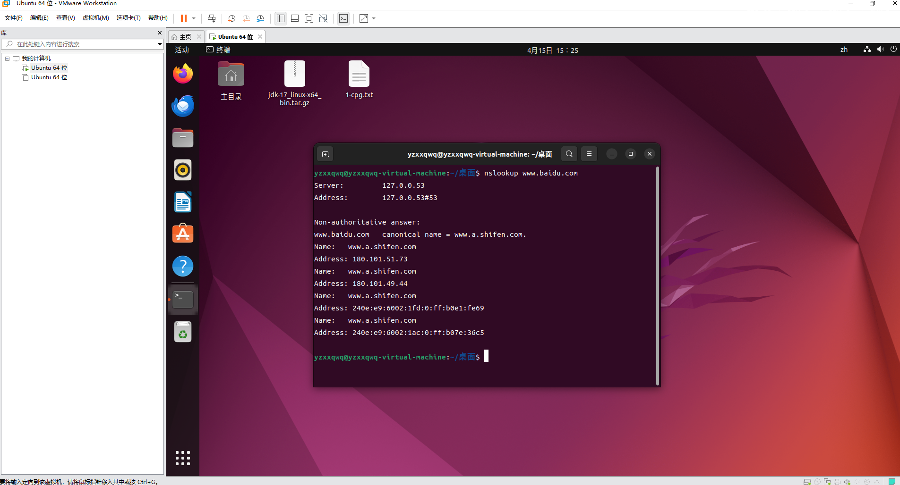
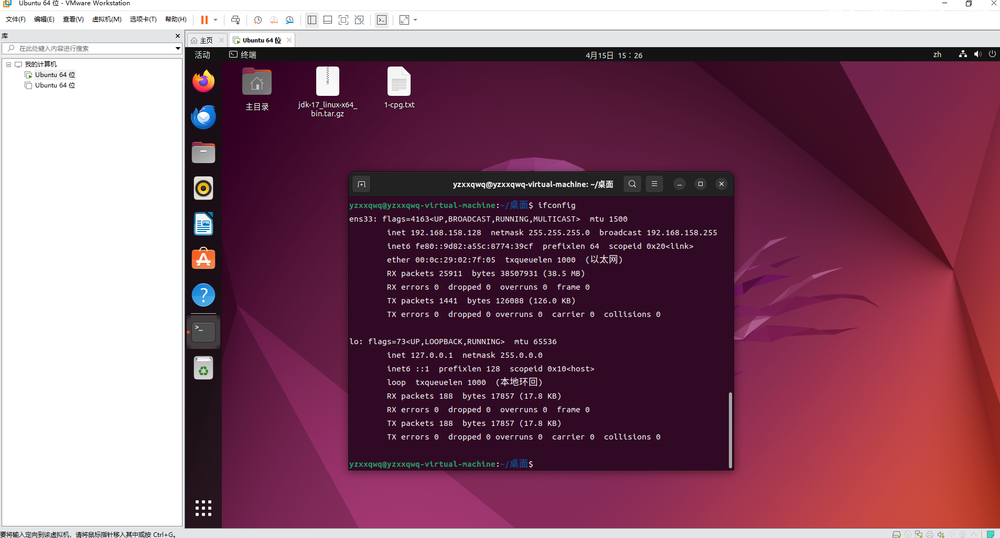
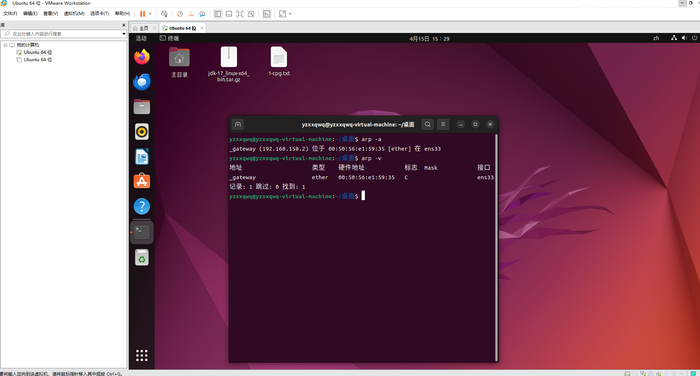
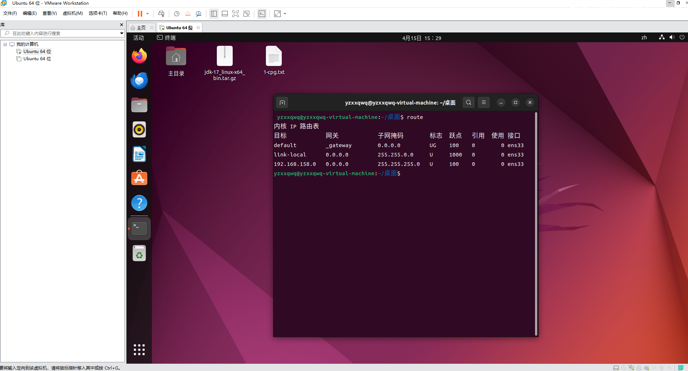
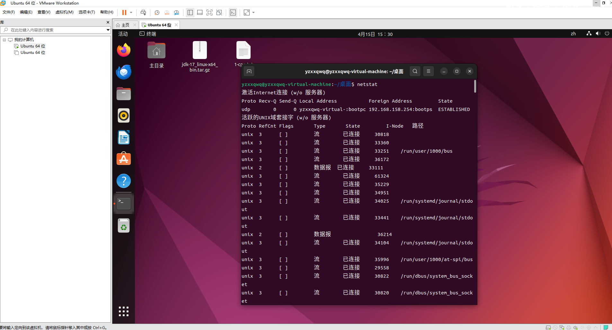
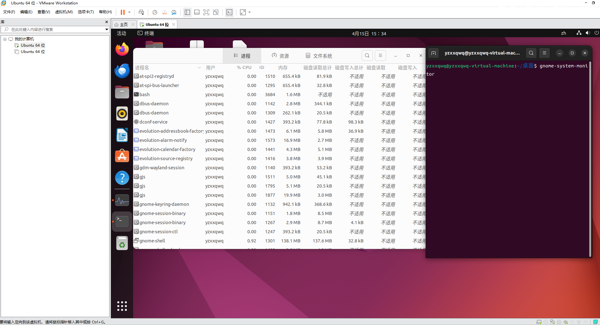

# Linux 基本操作学习报告

---

## 一、Linux 概述

### 1.1 什么是 Linux

Linux 是一种自由和开放源码的类 Unix 操作系统，由林纳斯·托瓦兹（Linus Torvalds）于 1991 年首次发布。Linux 通常指 Linux 内核，但人们也常用该词指代基于 Linux 内核的完整操作系统，即 GNU/Linux。

### 1.2 Linux 的主要特点

| 特性                       | 说明                                             |
| -------------------------- | ------------------------------------------------ |
| **开源免费**         | 源代码公开，可自由使用、修改和分发               |
| **多用户多任务**     | 支持多个用户同时登录，每个用户可同时运行多个程序 |
| **稳定性高**         | 可长时间连续运行，服务器领域首选                 |
| **安全性强**         | 完善的权限机制，病毒和恶意软件较少               |
| **高度可定制**       | 从嵌入式设备到超级计算机均可部署                 |
| **丰富的命令行工具** | 强大的 Shell 环境，高效完成各类任务              |

### 1.3 常见发行版

| 发行版                         | 特点                         | 适用场景                 |
| ------------------------------ | ---------------------------- | ------------------------ |
| **Ubuntu**               | 用户友好，社区活跃，文档丰富 | 桌面、服务器、初学者入门 |
| **CentOS / Rocky Linux** | 稳定可靠，企业级支持         | 服务器、企业应用         |
| **Debian**               | 稳定保守，软件包丰富         | 服务器、开发环境         |
| **Fedora**               | 技术前沿，Red Hat 上游       | 开发者、新技术体验       |
| **Arch Linux**           | 滚动更新，高度自定义         | 高级用户、极客           |

---

## 二、文件系统与目录结构

### 2.1 Linux 文件系统特点

- **一切皆文件**：硬件设备、进程、网络接口等都被抽象为文件
- **区分大小写**：`File.txt` 与 `file.txt` 是不同的文件
- **无盘符概念**：所有文件和目录都挂载在统一的根目录 `/` 下

### 2.2 目录结构（FHS 标准）

| 目录      | 全称                  | 功能说明                               |
| --------- | --------------------- | -------------------------------------- |
| `/`     | Root                  | 根目录，所有文件和目录的起点           |
| `/bin`  | Binaries              | 存放系统基本命令（如 ls, cp, mv）      |
| `/sbin` | System Binaries       | 存放系统管理命令（如 fdisk, ifconfig） |
| `/etc`  | Etcetera              | 存放系统配置文件                       |
| `/home` | Home                  | 普通用户的主目录                       |
| `/root` | Root Home             | root 用户的主目录                      |
| `/var`  | Variable              | 存放经常变化的文件（日志、缓存、邮件） |
| `/tmp`  | Temporary             | 临时文件目录，重启后通常清空           |
| `/usr`  | Unix System Resources | 用户程序和文件                         |
| `/opt`  | Optional              | 可选的第三方软件安装目录               |
| `/mnt`  | Mount                 | 临时挂载文件系统的挂载点               |
| `/dev`  | Devices               | 设备文件目录                           |
| `/proc` | Process               | 虚拟文件系统，存放进程和内核信息       |

### 2.3 路径表示

- **绝对路径**：从根目录 `/` 开始的完整路径，如 `/home/user/documents/file.txt`
- **相对路径**：相对于当前目录的路径
  - `.`：当前目录
  - `..`：上级目录
  - `~`：当前用户的主目录

---

## 三、基本命令操作

### 3.1 文件与目录操作

#### 3.1.1 目录操作

| 命令      | 功能                       | 常用示例                                                                     |
| --------- | -------------------------- | ---------------------------------------------------------------------------- |
| `pwd`   | 显示当前所在目录的绝对路径 | `pwd`                                                                      |
| `cd`    | 切换目录                   | `cd /home`；`cd ..`；`cd ~`                                            |
| `ls`    | 列出目录内容               | `ls -l`（详细列表）；`ls -a`（显示隐藏文件）；`ls -lh`（人类可读大小） |
| `mkdir` | 创建目录                   | `mkdir dirname`；`mkdir -p a/b/c`（递归创建）                            |
| `rmdir` | 删除空目录                 | `rmdir dirname`                                                            |
| `tree`  | 以树状图显示目录结构       | `tree -L 2`（显示两层）                                                    |

#### 3.1.2 文件操作

| 命令                | 功能                       | 常用示例                                                                   |
| ------------------- | -------------------------- | -------------------------------------------------------------------------- |
| `touch`           | 创建空文件或更新文件时间戳 | `touch file.txt`                                                         |
| `cp`              | 复制文件或目录             | `cp file1 file2`；`cp -r dir1 dir2`（递归复制目录）                    |
| `mv`              | 移动或重命名文件/目录      | `mv oldname newname`；`mv file /path/to/dest/`                         |
| `rm`              | 删除文件或目录             | `rm file.txt`；`rm -r dirname`（递归删除）；`rm -f file`（强制删除） |
| `cat`             | 查看文件内容               | `cat file.txt`；`cat -n file.txt`（显示行号）                          |
| `more` / `less` | 分页查看文件内容           | `less file.txt`（支持上下翻页、搜索）                                    |
| `head`            | 查看文件开头部分           | `head -n 20 file.txt`（查看前20行）                                      |
| `tail`            | 查看文件末尾部分           | `tail -f log.txt`（实时追踪日志）                                        |
| `wc`              | 统计文件行数、字数、字节数 | `wc -l file.txt`（统计行数）                                             |

### 3.2 文件权限管理

#### 3.2.1 权限基础

Linux 文件权限分为三类用户：

- **所有者（Owner）**：文件的创建者
- **所属组（Group）**：文件所属的用户组
- **其他用户（Others）**：系统中其他所有用户

每类用户具有三种权限：

- **r（read，4）**：读权限
- **w（write，2）**：写权限
- **x（execute，1）**：执行权限

#### 3.2.2 权限表示

使用 `ls -l` 查看权限：

-rwxr-xr-- 1 user group 1234 Jun 23 10:00 script.sh

| 位置            | 含义                                               |
| --------------- | -------------------------------------------------- |
| 第1位`-`      | 文件类型（`-` 普通文件，`d` 目录，`l` 链接） |
| 第2-4位`rwx`  | 所有者权限                                         |
| 第5-7位`r-x`  | 所属组权限                                         |
| 第8-10位`r--` | 其他用户权限                                       |

#### 3.2.3 权限修改

| 命令      | 功能           | 示例                                         |
| --------- | -------------- | -------------------------------------------- |
| `chmod` | 修改文件权限   | `chmod 755 file.sh`；`chmod u+x file.sh` |
| `chown` | 修改文件所有者 | `chown user:group file.txt`                |
| `chgrp` | 修改文件所属组 | `chgrp developers file.txt`                |

**数字权限计算：**

- `rwx` = 4 + 2 + 1 = **7**
- `r-x` = 4 + 0 + 1 = **5**
- `r--` = 4 + 0 + 0 = **4**

常用组合：

- `755`（`rwxr-xr-x`）：脚本、可执行文件
- `644`（`rw-r--r--`）：普通文档
- `700`（`rwx------`）：私密文件

### 3.3 用户管理

| 命令            | 功能                   | 示例                                    |
| --------------- | ---------------------- | --------------------------------------- |
| `whoami`      | 显示当前用户名         | `whoami`                              |
| `who` / `w` | 显示当前登录用户       | `w`                                   |
| `su`          | 切换用户               | `su - root`（切换到 root 并加载环境） |
| `sudo`        | 以超级用户权限执行命令 | `sudo apt update`                     |
| `useradd`     | 添加用户               | `sudo useradd -m username`            |
| `passwd`      | 修改密码               | `passwd`；`sudo passwd username`    |
| `userdel`     | 删除用户               | `sudo userdel -r username`            |

---

## 四、文本处理与搜索

### 4.1 文本查看与编辑

| 命令             | 功能               | 说明                 |
| ---------------- | ------------------ | -------------------- |
| `cat`          | 连接并显示文件内容 | 适合小文件           |
| `tac`          | 反向显示文件内容   | 从最后一行开始显示   |
| `nl`           | 带行号显示         | 类似`cat -n`       |
| `vi` / `vim` | 强大的文本编辑器   | 模式：普通/插入/命令 |
| `nano`         | 简易文本编辑器     | 适合初学者           |

**Vim 基本操作：**

| 操作         | 命令                                            |
| ------------ | ----------------------------------------------- |
| 进入插入模式 | `i`（光标前）/`a`（光标后）/`o`（下一行） |
| 保存并退出   | `:wq` 或 `ZZ`                               |
| 不保存退出   | `:q!`                                         |
| 删除一行     | `dd`                                          |
| 复制一行     | `yy`；粘贴 `p`                              |
| 撤销         | `u`                                           |
| 搜索         | `/keyword`（向下）；`?keyword`（向上）      |

### 4.2 文本搜索与过滤

| 命令       | 功能               | 常用示例                                                                                                   |
| ---------- | ------------------ | ---------------------------------------------------------------------------------------------------------- |
| `grep`   | 文本搜索           | `grep "error" log.txt`；`grep -i "error" file`（忽略大小写）；`grep -r "pattern" /path/`（递归搜索） |
| `find`   | 文件查找           | `find /home -name "*.txt"`；`find . -type f -size +100M`                                               |
| `locate` | 快速定位文件       | `locate filename`（基于数据库）                                                                          |
| `awk`    | 文本处理与报告生成 | `awk '{print $1}' file.txt`（打印第一列）                                                                |
| `sed`    | 流编辑器           | `sed 's/old/new/g' file.txt`（全局替换）                                                                 |
| `sort`   | 文本排序           | `sort -n file.txt`（按数字排序）                                                                         |
| `uniq`   | 去重               | `sort file.txt \| uniq`                                                                                   |
| `cut`    | 截取字段           | `cut -d':' -f1 /etc/passwd`                                                                              |

### 4.3 管道与重定向

| 符号   | 功能                                         | 示例                              |
| ------ | -------------------------------------------- | --------------------------------- |
| `\|`  | 管道：将前一个命令的输出作为后一个命令的输入 | `cat file.txt \| grep "keyword"` |
| `>`  | 输出重定向（覆盖）                           | `echo "hello" > file.txt`       |
| `>>` | 输出重定向（追加）                           | `echo "world" >> file.txt`      |
| `<`  | 输入重定向                                   | `cat < file.txt`                |
| `2>` | 错误输出重定向                               | `command 2> error.log`          |
| `&>` | 标准输出和错误同时重定向                     | `command &> output.log`         |

---

## 五、进程与系统管理

### 5.1 进程管理

| 命令                  | 功能                       | 常用示例                                           |
| --------------------- | -------------------------- | -------------------------------------------------- |
| `ps`                | 查看进程状态               | `ps aux`（显示所有进程）；`ps -ef`             |
| `top`               | 实时显示进程资源占用       | `top`；按 `M` 按内存排序；按 `P` 按 CPU 排序 |
| `htop`              | 交互式进程查看器（需安装） | `htop`                                           |
| `kill`              | 终止进程                   | `kill PID`；`kill -9 PID`（强制终止）          |
| `killall`           | 按名称终止进程             | `killall firefox`                                |
| `pkill`             | 按模式终止进程             | `pkill -f python`                                |
| `nice` / `renice` | 调整进程优先级             | `nice -n 10 command`                             |
| `nohup`             | 后台运行，忽略挂起信号     | `nohup python script.py &`                       |
| `&`                 | 将命令放入后台执行         | `command &`                                      |
| `jobs`              | 查看后台任务               | `jobs`                                           |
| `fg`                | 将后台任务调至前台         | `fg %1`                                          |
| `bg`                | 将暂停的任务在后台继续     | `bg %1`                                          |

### 5.2 系统信息查看

| 命令                   | 功能                             |
| ---------------------- | -------------------------------- |
| `uname -a`           | 显示系统内核信息                 |
| `hostname`           | 显示或设置主机名                 |
| `uptime`             | 显示系统运行时间和负载           |
| `df -h`              | 查看磁盘空间使用情况（人类可读） |
| `du -sh dirname`     | 查看指定目录的总大小             |
| `free -h`            | 查看内存使用情况                 |
| `lscpu`              | 查看 CPU 信息                    |
| `lsblk`              | 查看块设备信息                   |
| `dmesg`              | 查看内核环形缓冲区消息           |
| `env` / `printenv` | 显示环境变量                     |

### 5.3 磁盘管理

| 命令       | 功能               | 示例                          |
| ---------- | ------------------ | ----------------------------- |
| `fdisk`  | 磁盘分区表操作     | `sudo fdisk -l`（列出分区） |
| `mkfs`   | 创建文件系统       | `sudo mkfs.ext4 /dev/sdb1`  |
| `mount`  | 挂载文件系统       | `sudo mount /dev/sdb1 /mnt` |
| `umount` | 卸载文件系统       | `sudo umount /mnt`          |
| `fsck`   | 文件系统检查与修复 | `sudo fsck /dev/sda1`       |

---

## 六、网络管理

### 6.1 网络配置与诊断

| 命令                  | 功能                           | 常用示例                                 |
| --------------------- | ------------------------------ | ---------------------------------------- |
| `ifconfig` / `ip` | 查看和配置网络接口             | `ip addr`；`ip link`                 |
| `ping`              | 测试网络连通性                 | `ping www.baidu.com`                   |
| `netstat` / `ss`  | 查看网络连接、路由表、接口统计 | `ss -tuln`（查看监听端口）             |
| `traceroute`        | 追踪数据包路由路径             | `traceroute 8.8.8.8`                   |
| `curl`              | 命令行数据传输工具             | `curl -O http://example.com/file.zip`  |
| `wget`              | 下载文件                       | `wget http://example.com/file.zip`     |
| `scp`               | 安全复制文件（基于 SSH）       | `scp file.txt user@host:/path/`        |
| `rsync`             | 远程同步工具                   | `rsync -avz local/ user@host:/remote/` |
| `ssh`               | 远程登录                       | `ssh user@hostname`                    |

### 6.2 防火墙管理（以 firewalld / iptables 为例）

| 命令                                                | 功能           |
| --------------------------------------------------- | -------------- |
| `sudo systemctl status firewalld`                 | 查看防火墙状态 |
| `sudo firewall-cmd --list-all`                    | 查看防火墙规则 |
| `sudo firewall-cmd --add-port=80/tcp --permanent` | 开放 80 端口   |
| `sudo firewall-cmd --reload`                      | 重载防火墙配置 |

---

## 七、软件包管理

### 7.1 Debian/Ubuntu 系（APT）

| 命令                         | 功能                   |
| ---------------------------- | ---------------------- |
| `sudo apt update`          | 更新软件包列表         |
| `sudo apt upgrade`         | 升级已安装的软件包     |
| `sudo apt install package` | 安装软件包             |
| `sudo apt remove package`  | 卸载软件包             |
| `sudo apt purge package`   | 彻底卸载（含配置文件） |
| `sudo apt search keyword`  | 搜索软件包             |
| `sudo apt autoremove`      | 清理不再需要的依赖     |
| `dpkg -i package.deb`      | 安装本地 deb 包        |

### 7.2 Red Hat/CentOS 系（YUM/DNF）

| 命令                                      | 功能            |
| ----------------------------------------- | --------------- |
| `sudo yum update` / `sudo dnf update` | 更新系统        |
| `sudo yum install package`              | 安装软件包      |
| `sudo yum remove package`               | 卸载软件包      |
| `sudo yum search keyword`               | 搜索软件包      |
| `sudo rpm -ivh package.rpm`             | 安装本地 rpm 包 |

### 7.3 源码编译安装

基本流程：

下载源码 → 解压 → ./configure → make → sudo make install

---

## 八、Shell 脚本基础

### 8.1 什么是 Shell

Shell 是用户与 Linux 内核之间的接口，既是一种命令解释器，也是一门脚本编程语言。常见 Shell 包括 Bash（Bourne Again Shell）、Zsh、Fish 等，其中 Bash 是大多数 Linux 发行版的默认 Shell。

### 8.2 基本语法要素

| 要素               | 说明                     | 示例                                                                                 |
| ------------------ | ------------------------ | ------------------------------------------------------------------------------------ |
| **变量**     | 无需声明类型，赋值无空格 | `name="Linux"`；引用：`echo $name`                                               |
| **环境变量** | 全局生效，通常大写       | `export PATH=$PATH:/new/path`                                                      |
| **特殊变量** | 脚本内置变量             | `$0`（脚本名）；`$1`（第一个参数）；`$#`（参数个数）；`$?`（上条命令退出码） |
| **条件判断** | `if` 语句              | `if [ -f file.txt ]; then ... fi`                                                  |
| **循环**     | `for`、`while`       | `for i in 1 2 3; do echo $i; done`                                                 |
| **函数**     | 可复用代码块             | `function greet() { echo "Hello $1"; }`                                            |

### 8.3 常用测试表达式

| 表达式                | 含义           |
| --------------------- | -------------- |
| `[ -e file ]`       | 文件是否存在   |
| `[ -f file ]`       | 是否为普通文件 |
| `[ -d dir ]`        | 是否为目录     |
| `[ -r file ]`       | 是否可读       |
| `[ -w file ]`       | 是否可写       |
| `[ -x file ]`       | 是否可执行     |
| `[ "$a" = "$b" ]`   | 字符串相等     |
| `[ "$a" -eq "$b" ]` | 整数相等       |
| `[ "$a" -gt "$b" ]` | 整数大于       |

### 8.4 简单脚本示例

以下是一个备份目录的 Shell 脚本框架：

```bash
#!/bin/bash

# 定义变量
SOURCE_DIR="/home/user/documents"
BACKUP_DIR="/backup"
DATE=$(date +%Y%m%d)
ARCHIVE_NAME="backup_${DATE}.tar.gz"

# 检查源目录是否存在
if [ ! -d "$SOURCE_DIR" ]; then
    echo "错误：源目录不存在"
    exit 1
fi

# 创建备份目录（如果不存在）
mkdir -p "$BACKUP_DIR"

# 执行备份
tar -czf "${BACKUP_DIR}/${ARCHIVE_NAME}" "$SOURCE_DIR"

# 检查备份结果
if [ $? -eq 0 ]; then
    echo "备份成功：${ARCHIVE_NAME}"
else
    echo "备份失败"
    exit 1
fi
```
