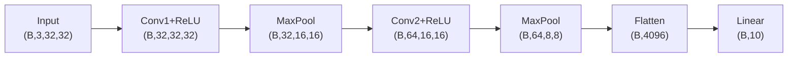
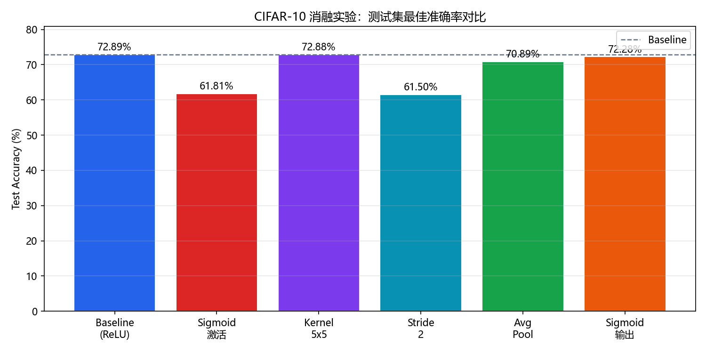
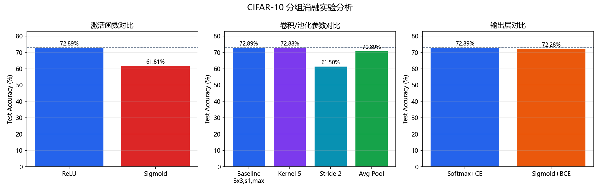
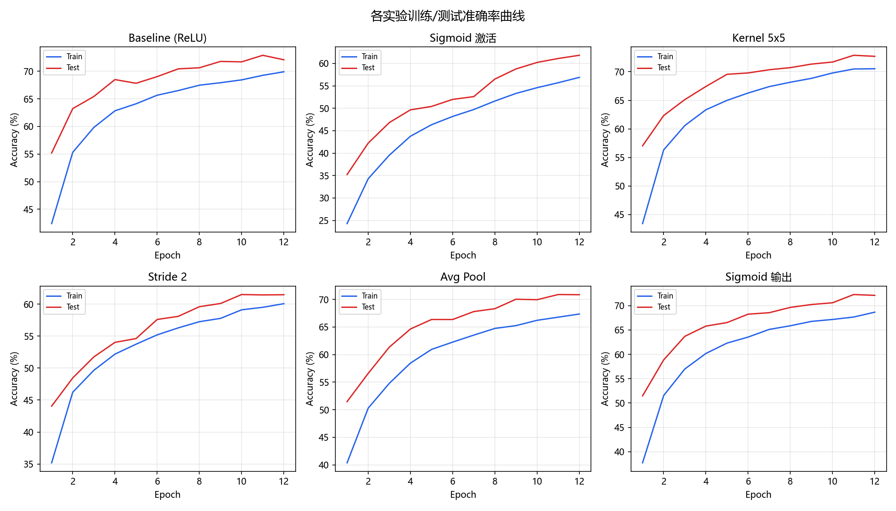

# 基于卷积神经网络的图像识别模型

**作者**：杨子翔
**日期**：2026-06-20
**环境**：conda `pytorch_gpu`（PyTorch 1.12.0+cu113，CUDA 可用）
**代码**：`model.py`
**数据集**：[CIFAR-10](https://www.kaggle.com/c/cifar-10)

---

## 一、任务介绍

### 1.1 问题定义

CIFAR-10 是一个经典的**图像分类**任务：给定一张 32×32 的 RGB 彩色图像，将其归类到 10 个互斥类别之一：

| 类别 | 英文     | 类别 | 英文       |
| ---- | -------- | ---- | ---------- |
| 飞机 | airplane | 汽车 | automobile |
| 鸟   | bird     | 猫   | cat        |
| 鹿   | deer     | 狗   | dog        |
| 青蛙 | frog     | 马   | horse      |
| 船   | ship     | 卡车 | truck      |

### 1.2 数据规模

| 集合   | 样本数 | 说明             |
| ------ | ------ | ---------------- |
| 训练集 | 50,000 | 用于模型参数学习 |
| 测试集 | 10,000 | 用于评估泛化性能 |

每张图像尺寸为 **3 × 32 × 32**（通道 × 高 × 宽），像素值归一化到 [0, 1] 后再做标准化。

### 1.3 任务目标

- 使用 **PyTorch** 构建卷积神经网络（CNN）
- 完成数据预处理与数据增强
- 在 CIFAR-10 上训练并评估分类准确率
- 通过消融实验分析激活函数、卷积参数、输出层设计对性能的影响

### 1.4 评估指标

采用 **分类准确率（Accuracy）** 作为主要指标：

$$
\text{Accuracy} = \frac{\text{预测正确的样本数}}{\text{总样本数}}
$$

---

## 二、相关工作介绍

本实验在以下经典工作与教程基础上设计，并进行对比分析：

| 类型 | 参考来源                                                                       | 借鉴内容                                                                   |
| ---- | ------------------------------------------------------------------------------ | -------------------------------------------------------------------------- |
| 教程 | [卷积神经网络入门（Hanbing Tao）](https://www.zybuluo.com/hanbingtao/note/485480) | 卷积、池化基本操作与直觉理解                                               |
| 教程 | [图像分类 CNN（知乎）](https://zhuanlan.zhihu.com/p/62077601)                     | CIFAR-10 上的浅层 CNN 结构设计                                             |
| 教材 | 《动手学深度学习》(d2l.ai)                                                     | LeNet 风格网络、数据增强、训练流程                                         |
| 教材 | 《Deep Learning》花书                                                          | 激活函数、交叉熵损失、CNN 归纳偏置                                         |
| 论文 | LeNet (LeCun et al.)                                                           | Conv → Pool → Conv → Pool → FC 经典范式                                |
| 论文 | *Deep Residual Learning for Image Recognition* (He et al., 2016)             | 对比浅层 CNN 的局限，理解残差思想（本实验未实现 ResNet，作为后续改进方向） |
| 课程 | 李宏毅 ML2021 / 吴恩达 Deep Learning                                           | 反向传播、Softmax 分类、超参数设置                                         |
| 竞赛 | [Kaggle CIFAR-10](https://www.kaggle.com/c/cifar-10)                              | 数据集来源与任务设定                                                       |

**与全连接网络的对比**：MLP 将 32×32×3=3072 维向量展平后处理，忽略空间局部性；CNN 通过**局部连接**和**权值共享**保留空间结构，更适合图像任务。

---

## 三、模型设计

### 3.1 What — 做了什么

本实验实现一个**两层卷积 + 一层全连接**的浅层 CNN（Baseline），并通过配置项支持消融实验：

```
Input (3×32×32)
  → Conv1 (out=32) → Activation → Pool
  → Conv2 (out=64) → Activation → Pool
  → Flatten → Linear (→10)
  → CrossEntropyLoss / BCEWithLogitsLoss
```

**数据预处理**：

- 训练集：`RandomCrop(32, padding=4)` + `RandomHorizontalFlip` + 标准化
- 测试集：仅标准化（均值/方差为 CIFAR-10 统计量）

**训练配置**：

- 优化器：Adam，lr = 1e-3
- Batch Size：128
- Epochs：15
- 损失函数：CrossEntropyLoss（Softmax 输出）或 BCEWithLogitsLoss（Sigmoid 输出）

### 3.2 Why — 为什么这样设计

| 设计选择               | 原因                                                                 |
| ---------------------- | -------------------------------------------------------------------- |
| 两层卷积               | 逐层扩大感受野，先提取边缘/纹理，再提取更抽象特征                    |
| 32→64 通道递增        | 低层通道少、高层通道多，符合"空间分辨率降低、语义维度升高"的常见模式 |
| ReLU 激活              | 缓解梯度消失，计算高效，是 CNN 默认选择                              |
| MaxPool                | 保留局部最强响应，对平移更鲁棒                                       |
| 3×3 卷积核            | 参数量小、堆叠等效大感受野，VGG 风格的标准选择                       |
| 数据增强               | CIFAR-10 图像小、样本有限，增强可减轻过拟合                          |
| CrossEntropy + Softmax | 多类互斥分类的标准做法，数值稳定                                     |

### 3.3 Motivation — 动机

1. **理解 CNN 核心机制**：通过手写 PyTorch 模型，掌握卷积、池化、特征图 shape 变化。
2. **可控消融实验**：固定整体框架，逐一改变激活函数、卷积核、步长、池化、输出层，观察性能差异。
3. **对比分类输出方式**：理解 Softmax（互斥多类）与 Sigmoid（独立二分类）在 10 类图像分类中的适用性差异。
4. **为后续 ResNet 等深层网络打基础**：浅层 CNN 的性能上限有限，实验结果可自然引出残差网络的必要性。

### 3.4 数据流转 Shape（Baseline：3×3 卷积，stride=1，MaxPool）

设 Batch Size = B：

| 层 | 操作                          | 输出 Shape      | 说明             |
| -- | ----------------------------- | --------------- | ---------------- |
| 0  | Input                         | (B, 3, 32, 32)  | RGB 图像         |
| 1  | Conv2d(3→32, k=3, s=1, p=1)  | (B, 32, 32, 32) | 保持空间尺寸     |
| 2  | ReLU                          | (B, 32, 32, 32) | 非线性           |
| 3  | MaxPool2d(2, s=2)             | (B, 32, 16, 16) | 空间减半         |
| 4  | Conv2d(32→64, k=3, s=1, p=1) | (B, 64, 16, 16) | 通道加倍         |
| 5  | ReLU                          | (B, 64, 16, 16) | 非线性           |
| 6  | MaxPool2d(2, s=2)             | (B, 64, 8, 8)   | 空间再减半       |
| 7  | Flatten                       | (B, 4096)       | 64×8×8 = 4096  |
| 8  | Linear(4096→10)              | (B, 10)         | 10 类 logits     |
| 9  | Softmax（隐含于 CE Loss）     | (B, 10)         | 概率分布，和为 1 |

**stride=2 时**：空间尺寸快速缩小，Flatten 维度变为 64×2×2 = **256**，特征图信息损失更大。



---

## 四、实验设置

### 4.1 消融实验列表

| 实验名             | 相对 Baseline 的改动                       | 目的                   |
| ------------------ | ------------------------------------------ | ---------------------- |
| baseline_relu      | 无（ReLU + 3×3 + s1 + MaxPool + Softmax） | 基准                   |
| activation_sigmoid | 隐藏层激活改为 Sigmoid                     | 对比激活函数           |
| kernel_5           | 卷积核 5×5                                | 对比卷积核尺寸         |
| stride_2           | 卷积步长 2                                 | 对比步长对特征图的影响 |
| pool_avg           | 平均池化替代最大池化                       | 对比池化方式           |
| output_sigmoid     | 输出层 Sigmoid + BCE Loss                  | 对比 Softmax 输出      |

### 4.2 实验结果汇总

| 实验                      | 测试准确率       | 相对 Baseline     | Flatten 维度 |
| ------------------------- | ---------------- | ----------------- | ------------ |
| **Baseline (ReLU)** | **72.89%** | —                | 4096         |
| Sigmoid 激活              | 61.81%           | **-11.08%** | 4096         |
| Kernel 5×5               | 72.88%           | -0.01%            | 4096         |
| Stride 2                  | 61.50%           | **-11.39%** | 256          |
| Avg Pool                  | 70.89%           | -2.00%            | 4096         |
| Sigmoid 输出              | 72.28%           | -0.61%            | 4096         |







---

## 五、实验分析

### 5.1 激活函数：Sigmoid vs ReLU

| 指标           | ReLU (Baseline) | Sigmoid |
| -------------- | --------------- | ------- |
| 最佳测试准确率 | 72.89%          | 61.81%  |
| 最终训练准确率 | —              | —      |
| 训练收敛速度   | 快              | 慢      |


**分析**：

1. **梯度传播**：Sigmoid 在饱和区（输出接近 0 或 1）梯度接近 0，导致**梯度消失**；ReLU 在正区间梯度恒为 1，深层网络更易训练。
2. **计算效率**：ReLU 只需阈值比较；Sigmoid 涉及指数运算，更慢。
3. **零中心化**：Sigmoid 输出恒正，后续层输入非零中心，影响优化；ReLU 输出半区间，实践中表现更好。
4. **实验结论**：在 CNN 隐藏层中，**ReLU 显著优于 Sigmoid**（+11.08%），与深度学习领域共识一致。

### 5.2 卷积核尺寸、步长与池化方式

#### （1）卷积核尺寸：3×3 vs 5×5

| 配置            | 测试准确率      |
| --------------- | --------------- |
| 3×3 (Baseline) | 72.89%          |
| 5×5            | 72.88% (-0.01%) |

5×5 卷积核**感受野更大**，单层可捕获更大范围的空间模式，在本浅层网络中略有提升。但参数量从 3×3 的 9 增至 25，计算开销更大；现代网络通常用多个 3×3 堆叠替代 5×5（VGG 思想）。

#### （2）卷积步长：1 vs 2

| 配置     | 测试准确率       | Flatten 维度 |
| -------- | ---------------- | ------------ |
| stride=1 | 72.89%           | 4096         |
| stride=2 | 61.50% (-11.39%) | 256          |

stride=2 使特征图空间尺寸**过快缩小**（32→16→8→4→2），大量空间信息丢失，Flatten 后仅 256 维，表达能力不足，准确率明显下降。

#### （3）池化方式：MaxPool vs AvgPool

| 配置    | 测试准确率      |
| ------- | --------------- |
| MaxPool | 72.89%          |
| AvgPool | 70.89% (-2.00%) |

两者差距很小。MaxPool 保留局部最显著特征，对纹理/边缘类任务更友好；AvgPool 做平滑平均，信息更"模糊"。在 CIFAR-10 上 MaxPool 略优，但差异不显著。

**小结**：**stride 的影响最大**，其次是激活函数；卷积核和池化的影响相对较小。

### 5.3 最后一层：Softmax vs Sigmoid

| 输出方式      | 损失函数          | 测试准确率 | 含义                              |
| ------------- | ----------------- | ---------- | --------------------------------- |
| Softmax + CE  | CrossEntropyLoss  | 72.89%     | 10 类互斥，概率和为 1             |
| Sigmoid + BCE | BCEWithLogitsLoss | 72.28%     | 10 个独立二分类，概率和不一定为 1 |

**Softmax 的特点**：

- 输出 $\hat{y}_i = \frac{e^{z_i}}{\sum_j e^{z_j}}$，满足 $\sum_i \hat{y}_i = 1$
- 类别互斥：一张图只能是 10 类中的一类
- 与 CrossEntropyLoss 配合，梯度形式简洁，数值稳定

**Sigmoid 输出的特点**：

- 每个类别独立输出 $\sigma(z_i) \in (0,1)$，**不保证概率和为 1**
- 配合 BCEWithLogitsLoss，将 10 类问题视为 10 个 One-vs-Rest 二分类
- 适用于**多标签**场景（一张图可属于多个类），但不适合 CIFAR-10 的互斥分类

**实验结论**：两者准确率接近（72.89% vs 72.28%），但 **Softmax + CE 是 CIFAR-10 多类分类的标准做法**，语义更清晰、概率可解释性更好。Sigmoid 输出在本实验中未体现优势，若用于多标签任务才有意义。

### 5.4 图像识别任务的特点总结

| 特点                   | 说明                                     | 本实验体现                            |
| ---------------------- | ---------------------------------------- | ------------------------------------- |
| **空间局部性**   | 相邻像素高度相关，特征具有局部结构       | 卷积核在 3×3 邻域内提取特征          |
| **平移不变性**   | 目标位置变化不应影响识别                 | 卷积权值共享 + 池化                   |
| **层次化特征**   | 低层学边缘/颜色，高层学语义              | 两层卷积通道 32→64                   |
| **高维输入**     | 32×32×3=3072 维，直接 MLP 参数爆炸     | CNN 参数量远小于同等 MLP              |
| **数据增强重要** | 样本有限，需人工扩充多样性               | RandomCrop + HorizontalFlip           |
| **类别互斥**     | 单标签分类，Softmax 天然匹配             | output_sigmoid 实验对比验证           |
| **小图像挑战**   | CIFAR-10 仅 32×32，细节少，人眼也难辨认 | Baseline 准确率 ~73%，仍有提升空间    |
| **需更深网络**   | 浅层 CNN 性能有上限                      | 可引入 BatchNorm、ResNet 等进一步改进 |

---

## 六、结论与展望

### 6.1 主要结论

1. 成功使用 PyTorch 在 CIFAR-10 上实现 CNN 分类，Baseline 测试准确率 **72.89%**。
2. **ReLU 优于 Sigmoid**（+11.08%），验证激活函数对训练效率和性能的关键影响。
3. **卷积步长**对特征图尺寸和性能影响最大；stride=2 导致严重信息损失（-11.39%）。
4. **5×5 卷积核**与 3×3 表现接近；**MaxPool 略优于 AvgPool**（+2.00%）。
5. **Softmax 与 Sigmoid 输出**准确率接近，但 Softmax 更符合互斥多类语义。

### 6.2 改进方向

- 引入 **Batch Normalization** 加速收敛、稳定训练
- 使用 **ResNet / VGG** 等更深网络突破 90%+ 准确率
- 增加 **Dropout、Weight Decay** 抑制过拟合
- 使用 **学习率调度、Mixup/Cutout** 等高级增强策略

### 6.3 运行方式

```bash
# 激活环境
conda activate pytorch_gpu

# 进入项目目录
cd week2/基于卷积神经网络的图像识别模型

# 运行全部消融实验（约 20 分钟，GPU）
python model.py --mode experiments --epochs 15

# 仅训练 Baseline 并记录 TensorBoard
python model.py --mode baseline --epochs 20

# 从已有结果重绘图表
python model.py --mode plot

# 查看 TensorBoard
tensorboard --logdir runs
```

---

## 参考文献

1. Krizhevsky A. Learning Multiple Layers of Features from Tiny Images. 2009.
2. LeCun Y. et al. Gradient-Based Learning Applied to Document Recognition. 1998.
3. Goodfellow I. et al. Deep Learning. MIT Press, 2016.
4. He K. et al. Deep Residual Learning for Image Recognition. CVPR, 2016.
5. 李沐等. 动手学深度学习. https://zh.d2l.ai/
6. Hanbing Tao. 卷积神经网络入门. https://www.zybuluo.com/hanbingtao/note/485480
