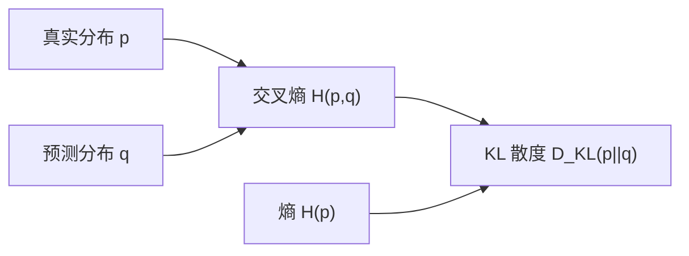
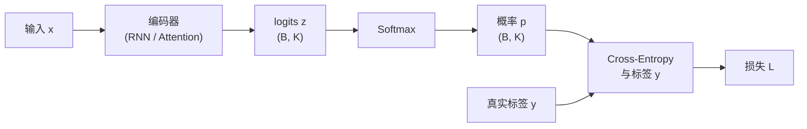
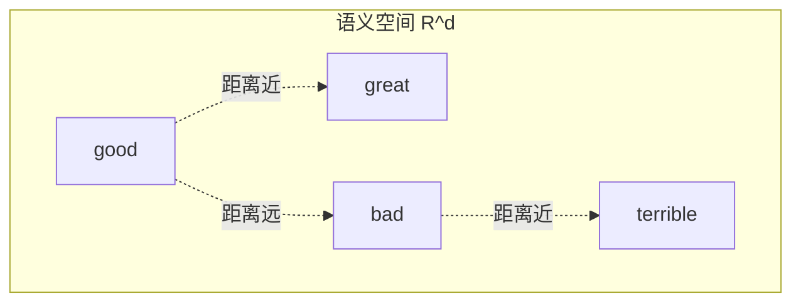
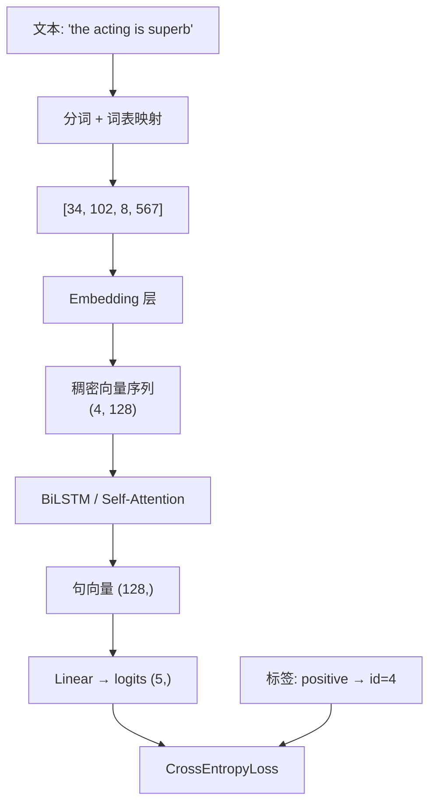

# 交叉熵损失函数、词向量与语义空间学习笔记

**作者**：杨子翔  
**日期**：2026-06-30  
**主题**：交叉熵损失函数、词向量（Word Embedding）、稠密向量、语义空间

---

## 目录

1. [从 MSE 到交叉熵：为什么分类用 CE](#一从-mse-到交叉熵为什么分类用-ce)
2. [信息论基础](#二信息论基础)
3. [交叉熵损失函数详解](#三交叉熵损失函数详解)
4. [Softmax 与交叉熵的组合](#四softmax-与交叉熵的组合)
5. [稀疏向量与稠密向量](#五稀疏向量与稠密向量)
6. [词向量（Word Embedding）](#六词向量word-embedding)
7. [语义空间（Semantic Space）](#七语义空间semantic-space)
8. [词表、OOV 与 Embedding 层实践](#八词表oov-与-embedding-层实践)

---

## 一、从 MSE 到交叉熵：为什么分类用 CE

### 1.1 任务类型与损失函数的匹配


| 任务类型 | 输出形式                                     | 常用损失                 | 典型场景           |
| ---- | ---------------------------------------- | -------------------- | -------------- |
| 回归   | 连续值 $\hat{y} \in \mathbb{R}$             | MSE / MAE            | 房价预测、COVID 阳性率 |
| 二分类  | 概率 $\hat{y} \in (0,1)$                   | Binary Cross-Entropy | 情感正/负          |
| 多分类  | 概率向量 $\hat{\mathbf{p}} \in \Delta^{K-1}$ | Cross-Entropy        | 5 档情感、10 类文本   |


week1 中 COVID 预测使用 **MSE/RMSE**（回归）；week3 情感分析使用 **交叉熵**（分类）——损失函数应与任务输出形式一致。

### 1.2 MSE 用于分类的问题

若对分类问题使用 MSE + Sigmoid：

$$
\mathcal{L}_{MSE} = (y - \sigma(z))^2
$$

当预测严重错误但 Sigmoid 已饱和（输出接近 0 或 1）时，**梯度接近 0** → 学习缓慢（梯度消失）。

交叉熵的梯度形式更"友好"：

$$
\frac{\partial \mathcal{L}_{CE}}{\partial z} = \hat{p} - y
$$

误差越大，梯度越大，收敛更快、更稳定。

---


## 二、信息论基础


### 2.1 熵（Entropy）

熵衡量随机变量的**不确定性**。离散分布 $p$ 的熵：

$$
H(p) = -\sum_{i} p_i \log p_i
$$

- 分布越均匀 → 不确定性越大 → 熵越高
- 分布越集中 → 熵越低

**示例**（二分类）：


| 分布             | $H(p)$ | 含义    |
| -------------- | ------ | ----- |
| $[0.5, 0.5]$   | 0.693  | 完全不确定 |
| $[0.99, 0.01]$ | 0.056  | 几乎确定  |
| $[1.0, 0.0]$   | 0      | 完全确定  |


### 2.2 交叉熵（Cross-Entropy）

交叉熵衡量**用预测分布 $q$ 编码真实分布 $p$ 所需的平均比特数**：

$$
H(p, q) = -\sum_{i} p_i \log q_i
$$

- 当 $q = p$ 时，交叉熵等于熵 $H(p)$（最优编码）
- 当 $q \neq p$ 时，交叉熵 $> H(p)$，差距越大惩罚越大


### 2.3 与 KL 散度的关系

$$
D_{KL}(p  q) = H(p, q) - H(p) = \sum_i p_i \log \frac{p_i}{q_i}
$$

最小化交叉熵 ⟺ 最小化 KL 散度（当 $p$ 固定时 $H(p)$ 为常数）  
→ **让预测分布 $q$ 逼近真实分布 $p$**。




---


## 三、交叉熵损失函数详解


### 3.1 二分类交叉熵（Binary Cross-Entropy, BCE）

真实标签 $y \in 0, 1$，预测概率 $\hat{p} = \sigma(z)$：

$$
\mathcal{L}_{BCE} = - \big[ y \log \hat{p} + (1-y) \log (1-\hat{p}) \big]
$$


| $y$ | $\hat{p}$ | 损失    | 含义       |
| --- | --------- | ----- | -------- |
| 1   | 0.9       | 0.105 | 预测正确，损失小 |
| 1   | 0.1       | 2.303 | 预测错误，损失大 |
| 0   | 0.1       | 0.105 | 预测正确，损失小 |
| 0   | 0.9       | 2.303 | 预测错误，损失大 |


**批量平均**（$N$ 个样本）：

$$
\mathcal{L} = -\frac{1}{N} \sum_{i=1}^{N} \big[ y_i \log \hat{p}_i + (1-y_i) \log (1-\hat{p}_i) \big]
$$

### 3.2 多分类交叉熵（Categorical Cross-Entropy, CE）

$K$ 个类别，真实标签为 **One-Hot** 向量 $\mathbf{y} = [0,\ldots,1,\ldots,0]$，预测概率 $\hat{\mathbf{p}} = [\hat{p}_1, \ldots, \hat{p}_K]$（Softmax 输出）：

$$
\mathcal{L}*{CE} = - \sum*{k=1}^{K} y_k \log \hat{p}_k
$$

由于 One-Hot 中只有 $y_c = 1$（$c$ 为真实类别），其余为 0，上式简化为：

$$
\mathcal{L}_{CE} = - \log \hat{p}_c
$$

**直觉**：希望模型对**正确类别**赋予**尽可能高的概率**；$-\log \hat{p}_c$ 在 $\hat{p}_c \to 0$ 时急剧增大。

**批量形式**（$N$ 个样本）：

$$
\mathcal{L} = -\frac{1}{N} \sum_{i=1}^{N} \sum_{k=1}^{K} y_{ik} \log \hat{p}_{ik}
$$

### 3.3 整数标签形式（PyTorch 常用）

真实标签为类别索引 $c \in 0, 1, \ldots, K-1$ 时，等价写法：

$$
\mathcal{L}_{CE} = - \log \hat{p}_c
$$

PyTorch 中 `nn.CrossEntropyLoss` 内部完成 Softmax + CE，**输入为 logits**（未归一化的 $z$），无需手动 Softmax。

### 3.4 交叉熵 vs MSE 对比


| 特性        | MSE                  | 交叉熵               |
| --------- | -------------------- | ----------------- |
| 适用任务      | 回归                   | 分类                |
| 输出范围      | $(-\infty, +\infty)$ | 概率 $(0,1)$ 或概率单纯形 |
| 误差大时梯度    | 可能饱和（+ Sigmoid）      | 通常更稳定             |
| 概率解释      | 无                    | 有（最大似然估计）         |
| 与 Softmax | 不推荐组合                | 天然搭配              |
| 情感分析      | 不适用（除非预测评分回归）        | **标准选择**          |


### 3.5 梯度推导（多分类）

设 logits 为 $z_k$，Softmax 输出 $\hat{p}_k = \frac{e^{z_k}}{\sum_j e^{z_j}}$，One-Hot 标签 $y_c=1$：

$$
\frac{\partial \mathcal{L}}{\partial z_k} = \hat{p}_k - y_k
$$

- 对正确类 $k=c$：梯度 $= \hat{p}_c - 1 < 0$ → 增大 $z_c$
- 对错误类 $k \neq c$：梯度 $= \hat{p}_k > 0$ → 减小 $z_k$

形式简洁，是分类任务首选损失的原因之一。

---


## 四、Softmax 与交叉熵的组合


### 4.1 Softmax 函数

将 logits 向量 $\mathbf{z} = [z_1, \ldots, z_K]$ 映射为概率分布：

$$
\hat{p}*k = \text{Softmax}(z_k) = \frac{e^{z_k}}{\sum*{j=1}^{K} e^{z_j}}
$$

性质：

- $\hat{p}_k > 0$
- $\sum_k \hat{p}_k = 1$
- 保持相对大小顺序（单调性）

**数值稳定写法**（减去最大值）：

$$
\hat{p}_k = \frac{e^{z_k - \max_j z_j}}{\sum_j e^{z_j - \max_j z_j}}
$$

### 4.2 完整分类 pipeline




| 步骤           | Shape（情感 5 分类示例） |
| ------------ | ---------------- |
| 句向量 / 序列表示   | (B, d)           |
| 线性层输出 logits | (B, 5)           |
| Softmax 概率   | (B, 5)           |
| 标签（整数）       | (B,) 取值 0–4      |
| 标量损失         | ()               |


### 4.3 PyTorch 示例

```python
import torch
import torch.nn as nn

# 5 类情感分类
criterion = nn.CrossEntropyLoss()
logits = torch.randn(32, 5)      # batch=32, 5 类 logits
labels = torch.randint(0, 5, (32,))  # 整数标签 0~4

loss = criterion(logits, labels)   # 内部: log_softmax + nll_loss
loss.backward()
```

**注意**：

- `CrossEntropyLoss` = `LogSoftmax` + `NLLLoss`
- 不要在 loss 前手动 Softmax，否则数值不稳定且重复计算


### 4.4 标签平滑（Label Smoothing，拓展）

硬 One-Hot 标签 $[0,0,1,0,0]$ 可能过拟合。标签平滑将真实分布改为：

$$
y_k' = \begin{cases} 1 - \epsilon & k = c  \epsilon / (K-1) & k \neq c \end{cases}
$$

常见 $\epsilon = 0.1$，可提升泛化。

---


## 五、稀疏向量与稠密向量


### 5.1 稀疏向量（Sparse Vector）

大多数分量为 **0**，仅少数维度非零。

**One-Hot 词向量**是典型的稀疏表示：


| 词      | 向量（词表大小 V=10000）                         |
| ------ | ---------------------------------------- |
| "good" | $[0, 0, \ldots, 1, \ldots, 0]$（第 i 位为 1） |
| "bad"  | $[0, \ldots, 1, \ldots, 0]$（第 j 位为 1）    |


维度 = 词表大小 $V$，通常 $10^4 \sim 10^6$。

**问题**：


| 问题   | 说明                             |
| ---- | ------------------------------ |
| 维度过高 | 存储与计算开销大                       |
| 语义正交 | 任意两词 One-Hot 内积为 0，无法表达相似性     |
| 无法泛化 | "good" 与 "great" 在向量空间中距离相等且最远 |
| 数据稀疏 | 高维空间中样本极度稀疏                    |


### 5.2 稠密向量（Dense Vector）

大多数分量**非零**，维度 $d \ll V$（典型 $d = 50 \sim 1024$）。

$$
\mathbf{v}_{\text{good}} = [0.21, -0.45, 0.88, \ldots, 0.12] \in \mathbb{R}^d
$$


| 特性    | 稀疏（One-Hot）     | 稠密（Embedding）   |
| ----- | --------------- | --------------- |
| 维度    | $V$（大）          | $d$（小）          |
| 非零元素  | 1 个             | 全部或大部分          |
| 语义相似性 | 无法表达            | 相似词向量接近         |
| 存储    | $O(V)$ per word | $O(d)$ per word |
| 可学习   | 否（固定映射）         | 是（随任务微调）        |


### 5.3 从稀疏到稠密的映射


数学上，Embedding 等价于查表：

$$
\mathbf{e}_w = \mathbf{E}[idx(w)] \in \mathbb{R}^d
$$

其中 $\mathbf{E} \in \mathbb{R}^{V \times d}$ 为**可学习的嵌入矩阵**。

---


## 六、词向量（Word Embedding）


### 6.1 定义

**词向量**（Word Embedding）是将词映射到**低维连续向量空间**的表示方法，使得**语义相近的词在空间中距离较近**。

核心假设（**分布假说**，Harris, 1954）：

> "You shall know a word by the company it keeps."  
> 词语的语义由其上下文决定。


### 6.2 经典词向量方法


#### （1）Word2Vec（Mikolov et al., 2013）

两种训练目标：


| 模型            | 训练方式      | 思想      |
| ------------- | --------- | ------- |
| **CBOW**      | 用上下文预测中心词 | 聚合上下文信息 |
| **Skip-gram** | 用中心词预测上下文 | 适合稀有词   |


目标函数（Skip-gram 简化）：

$$
\max \frac{1}{T} \sum_{t=1}^{T} \sum_{-c \leq j \leq c, j \neq 0} \log P(w_{t+j} \mid w_t)
$$

**Negative Sampling** 加速训练，将多分类 Softmax 转为二分类问题。

#### （2）GloVe（Pennington et al., 2014）

**Global Vectors**：利用全局词共现统计矩阵：

$$
\mathbf{w}_i^\top \tilde{\mathbf{w}}_j + b_i + \tilde{b}*j = \log X*{ij}
$$

$X_{ij}$ 为词 $i$ 与词 $j$ 的共现次数。结合全局统计与局部上下文优点。

#### （3）FastText

将词表示为 **字符 n-gram 向量之和**，可处理 OOV 与子词信息。

### 6.3 方法对比


| 方法          | 训练数据     | 特点                       |
| ----------- | -------- | ------------------------ |
| Word2Vec    | 大规模无标注语料 | 快，适合相似词                  |
| GloVe       | 共现矩阵     | 全局统计，线性关系好               |
| FastText    | 子词级      | OOV 友好                   |
| ELMo / BERT | 上下文相关    | 同一词在不同句中向量不同（Contextual） |


### 6.4 神经网络中的 Embedding 层

```python
import torch.nn as nn

vocab_size = 10000   # 词表大小
embed_dim = 128        # 稠密向量维度

embedding = nn.Embedding(vocab_size, embed_dim, padding_idx=0)
# padding_idx=0: <PAD> 不参与梯度更新

token_ids = torch.LongTensor([[3, 42, 7, 0, 0]])  # (B, seq_len)
vectors = embedding(token_ids)                     # (B, seq_len, 128)
```

**Shape 流转**：


| 阶段             | Shape      | 说明                  |
| -------------- | ---------- | ------------------- |
| 输入 token ids   | (B, L)     | 整数索引                |
| Embedding 输出   | (B, L, d)  | 每个 token 变为 d 维稠密向量 |
| BiLSTM 输出      | (B, L, 2h) | 序列编码                |
| 池化 / Attention | (B, d')    | 句向量                 |
| 分类 logits      | (B, K)     | K 类情感               |


### 6.5 预训练 vs 随机初始化


| 策略       | 做法                    | 优缺点            |
| -------- | --------------------- | -------------- |
| 随机初始化    | $\mathbf{E}$ 随机，端到端训练 | 需大量数据          |
| 预训练 + 冻结 | 加载 GloVe/Word2Vec，不更新 | 小数据集友好，灵活性差    |
| 预训练 + 微调 | 加载预训练，继续训练            | **常用**，兼顾语义与任务 |


---


## 七、语义空间（Semantic Space）


### 7.1 什么是语义空间

**语义空间**（Semantic Space / Vector Space Model）是一个 $d$ 维实数向量空间 $\mathbb{R}^d$，其中：

- 每个词（或句子）对应空间中的一个点（向量）
- **语义关系**转化为**几何关系**（距离、方向、夹角）




### 7.2 相似度度量

给定向量 $\mathbf{u}, \mathbf{v}$：


| 度量        | 公式                                   | 特点                      |
| --------- | ------------------------------------ | ----------------------- |
| **欧氏距离**  | $                                    | \mathbf{u} - \mathbf{v} |
| **余弦相似度** | $\frac{\mathbf{u} \cdot \mathbf{v}}{ | \mathbf{u}              |
| **点积**    | $\mathbf{u} \cdot \mathbf{v}$        | 简单，Attention 中常用        |


余弦相似度 $\in [-1, 1]$（非负向量时 $\in [0,1]$），越接近 1 越相似。

### 7.3 经典的线性类比

Word2Vec 最著名的性质 — **向量运算对应语义关系**：

$$
\mathbf{v}*{\text{king}} - \mathbf{v}*{\text{man}} + \mathbf{v}*{\text{woman}} \approx \mathbf{v}*{\text{queen}}
$$

$$
\mathbf{v}*{\text{Paris}} - \mathbf{v}*{\text{France}} + \mathbf{v}*{\text{Italy}} \approx \mathbf{v}*{\text{Rome}}
$$

说明 Embedding 捕获了**性别、国家-首都**等线性结构。

### 7.4 情感分析中的语义空间

在情感分析任务中，理想情况下：


| 词群                              | 在空间中应          |
| ------------------------------- | -------------- |
| good, great, excellent, amazing | 彼此接近，远离负面词     |
| bad, terrible, awful, boring    | 彼此接近           |
| not, never, hardly              | 与否定结构相关，影响极性组合 |


**训练后的词向量可视化**（如 [TensorBoard Projector](http://projector.tensorflow.org/)）可验证：

- 正面情感词是否聚类
- 负面情感词是否聚类
- 与任务标签是否一致


### 7.5 句向量 vs 词向量


| 表示  | 粒度  | 获取方式                                  |
| --- | --- | ------------------------------------- |
| 词向量 | 词   | Embedding 层 / Word2Vec                |
| 句向量 | 句   | 词向量平均 / LSTM 最后时刻 / Self-Attention 加权 |


句向量将整个句子映射到语义空间中的一个点，用于**句子级情感分类**。

### 7.6 降维可视化

高维向量（128/300 维）无法直接展示，常用：


| 方法        | 说明                 |
| --------- | ------------------ |
| **t-SNE** | 非线性降维，保留局部结构，可视化聚类 |
| **PCA**   | 线性降维，保留全局方差        |
| **UMAP**  | 兼顾局部与全局，速度较快       |


---


## 八、词表、OOV 与 Embedding 层实践


### 8.1 词表构建流程

```
训练语料
  → 分词（空格 / BPE / WordPiece）
  → 统计词频
  → 保留高频 Top-N 词（如 10000）
  → 添加特殊 token: <PAD>, <UNK>, <SOS>, <EOS>
  → 词 → id 映射（Vocabulary）
```


### 8.2 特殊 Token


| Token             | 作用                      |
| ----------------- | ----------------------- |
| `<PAD>`           | 填充至 batch 内最大长度，id 通常=0 |
| `<UNK>`           | 词表外词（OOV）的占位符           |
| `<SOS>` / `<EOS>` | 序列起止（生成任务）              |


### 8.3 OOV（Out-of-Vocabulary）问题

**定义**：测试时出现训练词表中**未收录**的词。


| 策略          | 做法                                 | 效果           |
| ----------- | ---------------------------------- | ------------ |
| 映射为 `<UNK>` | 所有 OOV 共用一个向量                      | 简单，丢失词义      |
| 子词（BPE）     | "unhappiness" → "un" + "happiness" | 大幅减少 OOV     |
| 字符级         | 字符组合表示词                            | 几乎无 OOV，序列变长 |
| 扩大词表        | 提高 Top-N                           | 内存增加         |


**词表大小的权衡**（本课程实验分析点）：


| 词表大小   | OOV 率 | 参数量（Embedding）   |
| ------ | ----- | ---------------- |
| 5,000  | 高     | $5000 \times d$  |
| 10,000 | 中     | $10000 \times d$ |
| 50,000 | 低     | $50000 \times d$ |


### 8.4 完整数据流（情感分析）




---

