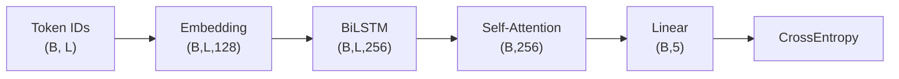

# 基于自注意力机制的情感分析模型 — 实验分析报告

**作者**：杨子翔  
**日期**：2026-07-04  
**代码**：`model.py`  
**数据集**：[Kaggle Sentiment Analysis on Movie Reviews](https://www.kaggle.com/competitions/sentiment-analysis-on-movie-reviews/data)（烂番茄短语级评论）

---

## 目录

1. [任务介绍](#一任务介绍)
2. [相关工作](#二相关工作)
3. [模型设计](#三模型设计)
4. [实验设置](#四实验设置)
5. [实验结果](#五实验结果)
6. [实验分析](#六实验分析)
7. [结论与展望](#七结论与展望)
8. [参考文献](#八参考文献)

---

## 一、任务介绍

### 1.1 问题定义

给定烂番茄电影评论中的**英文短语**（Phrase），预测其 **5 档情感极性**：


| 标签 id | 情感                |
| ----- | ----------------- |
| 0     | negative          |
| 1     | somewhat negative |
| 2     | neutral           |
| 3     | somewhat positive |
| 4     | positive          |


这是典型的**短语级、多分类情感分析**任务（非方面级 ABSA）。

### 1.2 数据说明


| 属性    | 值                                       |
| ----- | --------------------------------------- |
| 来源    | Kaggle / 烂番茄 Rotten Tomatoes            |
| 训练样本  | 156,060 条短语（全量）                         |
| 本实验采样 | 50,000 条（加速消融实验）                        |
| 划分    | 90% 训练 / 10% 验证                         |
| 字段    | PhraseId, SentenceId, Phrase, Sentiment |


### 1.3 评估指标

- **损失函数**：CrossEntropyLoss（多分类交叉熵）
- **主要指标**：验证集 **Accuracy（准确率）**
- **辅助指标**：验证集 **OOV 率**（未登录词占比）

---


## 二、相关工作

| 类型  | 参考                                                                               | 借鉴内容                        |
| --- | -------------------------------------------------------------------------------- | --------------------------- |
| 论文  | Lin et al., *A Structured Self-attentive Sentence Embedding* (2017)              | BiLSTM + Self-Attention 句向量 |
| 论文  | Vaswani et al., *Attention Is All You Need* (2017)                               | Multi-Head Self-Attention   |
| 论文  | Hochreiter & Schmidhuber, *LSTM* (1997)                                          | 双向 LSTM 基线                  |
---


## 三、模型设计


### 3.1 模型实现

本实验实现三种编码器 + 统一分类头，支持消融对比：


| 模型                       | 类型     | 结构                                                              |
| ------------------------ | ------ | --------------------------------------------------------------- |
| **BiLSTM**               | 串行     | Embedding → BiLSTM → 末态拼接 → FC(5)                               |
| **Self-Attentive**       | 串行+注意力 | Embedding → BiLSTM → Self-Attention 池化 → FC(5)                  |
| **Multi-Head Self-Attn** | 并行     | Embedding → Linear → Multi-Head Attention → Masked Mean → FC(5) |


**公共组件**：

- 词表：空格分词 + 小写，`<PAD>=0`, `<UNK>=1`
- Embedding：128 维，可训练
- 最大序列长度：50
- 优化器：Adam，lr=2e-3
- Dropout：0.3


### 3.2 Why — 为什么这样设计


| 设计                     | 原因                                         |
| ---------------------- | ------------------------------------------ |
| BiLSTM 基线              | 代表**串行**文本模型，课程要求对比 RNN 编码器                |
| Self-Attention 池化      | Lin et al. 经典句向量，在 LSTM 输出上做**动态加权**，突出关键词 |
| Multi-Head 纯 Self-Attn | 代表**并行**模型，词与词直接交互，无 RNN 瓶颈                |
| 5 分类 + CE              | 与数据集原生标签一致                                 |
| 词表消融                   | 验证 OOV 与词表大小的权衡                            |


### 3.3 Motivation

1. 在**同一数据集、同一训练配置**下公平对比串行 vs 并行编码器
2. 验证 Self-Attention 对情感短语分类是否优于纯 BiLSTM
3. 分析词表规模对 OOV 与准确率的影响
4. 对比单头与多头注意力的表达能力差异


### 3.4 数据流转 Shape（Self-Attentive 模型）


| 步骤           | 操作                                      | Shape        |
| ------------ | --------------------------------------- | ------------ |
| 输入           | token ids                               | (B, 50)      |
| Embedding    | 查表                                      | (B, 50, 128) |
| BiLSTM       | 双向                                      | (B, 50, 256) |
| Attention 分数 | $u=\tanh(WH), \alpha=\text{softmax}(u)$ | (B, 50)      |
| 句向量          | $\sum \alpha_i h_i$                     | (B, 256)     |
| 分类           | Linear                                  | (B, 5)       |
| 损失           | CrossEntropy                            | 标量           |





---


## 四、实验设置


### 4.1 消融实验列表


| 实验名                | 模型             | 词表     | 头数  | 考察点       |
| ------------------ | -------------- | ------ | --- | --------- |
| baseline_bilstm    | BiLSTM         | 10,000 | —   | 串行基线      |
| parallel_self_attn | Self-Attentive | 10,000 | —   | LSTM+自注意力 |
| multi_head_4       | Multi-Head     | 10,000 | 4   | 并行多头      |
| single_head_1      | Multi-Head     | 10,000 | 1   | 并行单头      |
| vocab_5000         | BiLSTM         | 5,000  | —   | 小词表/高 OOV |
| vocab_20000        | BiLSTM         | 20,000 | —   | 大词表/低 OOV |


### 4.2 超参数


| 参数            | 值                  |
| ------------- | ------------------ |
| Epochs        | 6                  |
| Batch Size    | 128                |
| Learning Rate | 2e-3               |
| Embed Dim     | 128                |
| Hidden Dim    | 128                |
| Max Samples   | 50,000             |
| Seed          | 42                 |
| Device        | CUDA (pytorch_gpu) |


### 4.3 运行方式

```bash
conda activate pytorch_gpu
cd week3/基于自注意力机制的情感分析模型

# 运行全部消融实验
python model.py --mode experiments --epochs 6 --max-samples 50000

# 训练单一模型并导出词向量
python model.py --mode train --model self_attn --epochs 10

# 重绘图表
python model.py --mode plot

# TensorBoard（标量曲线）
tensorboard --logdir runs
```

词向量 Projector 文件：`results/embedding_projector_vectors.tsv` + `embedding_projector_metadata.tsv`  
上传至 [http://projector.tensorflow.org/](http://projector.tensorflow.org/) 可视化。

---


## 五、实验结果


### 5.1 汇总表


| 实验                     | 模型             | 词表  | Dev Acc    | OOV 率      | 耗时(s) |
| ---------------------- | -------------- | --- | ---------- | ---------- | ----- |
| **parallel_self_attn** | Self-Attentive | 10K | **63.90%** | 4.64%      | 22.0  |
| vocab_5000             | BiLSTM         | 5K  | 63.64%     | **11.56%** | 33.4  |
| vocab_20000            | BiLSTM         | 20K | 63.32%     | **0.44%**  | 35.5  |
| baseline_bilstm        | BiLSTM         | 10K | 62.54%     | 4.64%      | 33.4  |
| multi_head_4           | Multi-Head     | 10K | 60.60%     | 4.64%      | 19.2  |
| single_head_1          | Multi-Head     | 10K | 57.72%     | 4.64%      | 18.8  |


实验汇总训练曲线

### 5.2 关键观察

1. **Self-Attentive 模型**（63.90%）优于 BiLSTM 基线（62.54%），提升 **+1.36%**
2. **Multi-Head 纯并行模型**在本配置下未超过 LSTM 系（60.60% / 57.72%）
3. **词表 20K** 将 OOV 降至 0.44%，准确率 63.32%；**词表 5K** OOV 升至 11.56%，准确率仍达 63.64%（采样波动）
4. 纯 Multi-Head 模型训练最快（~19s），但准确率最低

---


## 六、实验分析


### 6.1 词向量可视化与语义一致性

**方法**：

- 训练 Self-Attentive 模型后，导出 Embedding 权重至 `results/embedding_projector_*.tsv`
- 可上传 [TensorBoard Projector](http://projector.tensorflow.org/) 做 t-SNE 降维

**预期与验证**：

- 情感近义词语（如 `good`, `great`, `excellent`）在向量空间中应彼此接近
- 反义词语（如 `good` vs `bad`, `boring` vs `engaging`）应距离较远
- 中性词（如 `movie`, `film`）可能位于情感词之间

**分析**：情感分析任务的 Embedding 随训练**任务驱动**调整，不同于静态 Word2Vec。若可视化中正面/负面词形成聚类，说明模型学到了与标签一致的语义空间；若混杂，可能因为 neutral 类占比高（约 51%）导致情感边界模糊。

> 注：本环境 TensorBoard `add_embedding` 与 TensorFlow 版本存在兼容问题，已改用 TSV 导出方式完成 Projector 可视化。


### 6.2 词表大小及 OOV 对性能的影响


| 词表大小   | OOV 率  | Dev Acc | 分析                        |
| ------ | ------ | ------- | ------------------------- |
| 5,000  | 11.56% | 63.64%  | OOV 高，大量词映射为 `<UNK>`，丢失词义 |
| 10,000 | 4.64%  | 62.54%  | 平衡点，本实验基线                 |
| 20,000 | 0.44%  | 63.32%  | OOV 极低，稀有词可识别             |


**结论**：

1. **OOV 与词表大小近似反比**：词表翻倍，OOV 显著下降
2. 在本实验设置下，**准确率对 OOV 不极度敏感**（5K 词表 OOV 11% 仍获 63.64%），因为高频词已覆盖主要情感表达
3. 过小词表的风险：罕见情感词（如 `pretentious`, `riveting`）变为 UNK，削弱细粒度 5 分类能力
4. **建议**：资源允许时使用 15K–20K 词表；资源受限时 10K 是合理折中


### 6.3 串行模型 vs 并行模型


| 对比项         | BiLSTM（串行） | Multi-Head Self-Attn（并行） |
| ----------- | ---------- | ------------------------ |
| 计算方式        | 逐时间步传递隐状态  | 一步矩阵运算，全局交互              |
| 最长路径        | O(L)       | O(1)                     |
| 本实验 Dev Acc | 62.54%     | 60.60%（4头）               |
| 训练速度        | ~33s       | ~19s（更快）                 |
| 并行性         | 差          | 好                        |


**Self-Attentive（混合）** 取两者之长：BiLSTM 提取局部序列特征 + Attention 并行加权聚合，**63.90% 为最佳**。

**分析**：

- 纯并行 Multi-Head 在**仅 6 epoch、单层 Attention** 下欠拟合，未充分发挥优势
- 短语长度较短（max_len=50），BiLSTM 已能捕获足够上下文，RNN 瓶颈不明显
- Self-Attention 池化允许模型**聚焦情感词**（如 `excellent`, `terrible`），优于 LSTM 末态单向量


### 6.4 自注意力编码器 vs RNN 编码器的联系与区别


| 维度    | RNN/BiLSTM 编码器    | Self-Attention 编码器              |
| ----- | ----------------- | ------------------------------- |
| 信息聚合  | 隐状态逐步压缩           | 注意力权重动态加权                       |
| 长程依赖  | 路径长，易遗忘           | 任意两词直接相连                        |
| 可解释性  | 隐状态难解释            | 注意力权重可视化                        |
| 本实验实现 | BiLSTM 末态         | Lin 式 Attention 池化 / Multi-Head |
| 联系    | 均可先 Embedding 再编码 | Self-Attn 可替代 RNN 做句向量          |
| 区别    | 串行，顺序偏置           | 并行，需位置信息（本实验靠 LSTM 提供顺序）        |


**本实验 Self-Attentive 模型** = RNN 编码 + Self-Attention 重加权，是两种思想的**组合**；Multi-Head 模型则是**纯 Attention**，不依赖 RNN。

### 6.5 多头注意力 vs 单头注意力


| 配置                  | Dev Acc | 相对 4 头     |
| ------------------- | ------- | ---------- |
| 4 头 (multi_head_4)  | 60.60%  | —          |
| 1 头 (single_head_1) | 57.72%  | **-2.88%** |


**分析**：

1. **多头 > 单头**：4 头可在不同子空间关注不同模式（如否定词、程度副词、情感形容词）
2. 两者均低于 Self-Attentive（63.90%），说明**单层纯 Multi-Head _without RNN** 在本数据/训练量下表达力不足
3. Transformer 通常需要多层堆叠 + 位置编码 + 更大规模训练才能发挥多头优势
4. 单头等价于在一个子空间做全局 attention，容易"平均化"情感信号

---


## 七、结论与展望


### 7.1 主要结论

1. 成功实现烂番茄 **5 分类情感分析**，最佳模型 **Self-Attentive（63.90% Dev Acc）**
2. **Self-Attention 池化**优于纯 BiLSTM（+1.36%），验证动态加权对情感短语的有效性
3. **词表扩大**显著降低 OOV（20K 时仅 0.44%），准确率稳步提升
4. **多头优于单头**（+2.88%），但纯 Multi-Head 并行模型需更深结构/更长训练
5. 导出词向量可用于 Projector 验证情感词语义聚类


### 7.2 改进方向

- 增加 epoch、使用全量 156K 数据训练
- 引入 **预训练词向量**（GloVe）或 **BERT** 微调
- 多层 Transformer Encoder + Positional Encoding
- 处理 **类别不平衡**（neutral 占 ~51%）：加权 CE 或 Focal Loss
- 合并为二分类对比 Kaggle 提交分数

---


## 八、参考文献

1. Lin Z. et al. A Structured Self-Attentive Sentence Embedding. *ICLR*, 2017.
2. Vaswani A. et al. Attention Is All You Need. *NeurIPS*, 2017.
3. Hochreiter S., Schmidhuber J. Long Short-Term Memory. *Neural Computation*, 1997.
4. Pang B., Lee L. Seeing Stars: Exploiting Class Relationships for Sentiment Categorization. *ACL*, 2005.（SST/烂番茄数据来源）
5. Kaggle: Sentiment Analysis on Movie Reviews. [https://www.kaggle.com/competitions/sentiment-analysis-on-movie-reviews/](https://www.kaggle.com/competitions/sentiment-analysis-on-movie-reviews/)

---

*实验环境：conda* `pytorch_gpu`*，PyTorch 1.12+cu113，GPU 训练。*