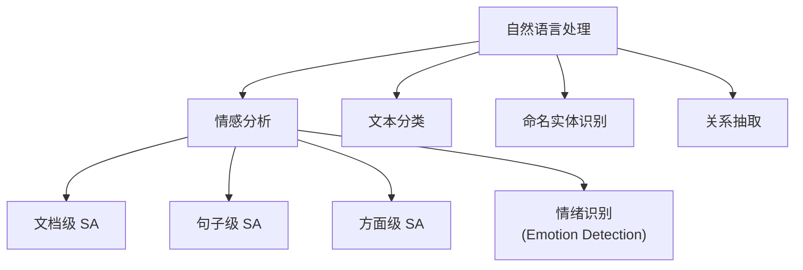
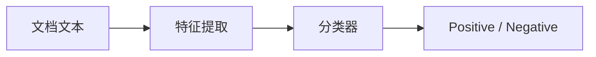
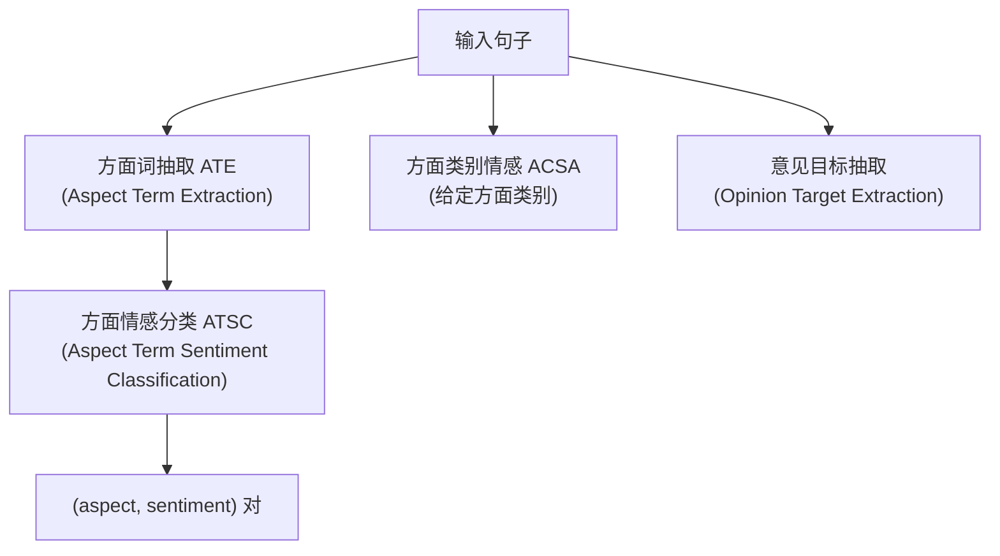

# 情感分析任务学习笔记

**作者**：杨子翔  
**日期**：2026-07-02  
**主题**：情感分析（Sentiment Analysis）、方面级情感分析（Aspect-Based Sentiment Analysis, ABSA）

---

## 目录

1. [情感分析概述](#一情感分析概述)
2. [任务层级与分类体系](#二任务层级与分类体系)
3. [标签设计与数据处理](#三标签设计与数据处理)
4. [典型数据集与评测指标](#四典型数据集与评测指标)
5. [文档级与句子级情感分析](#五文档级与句子级情感分析)
6. [方面级情感分析（ABSA）](#六方面级情感分析absa)
7. [挑战与难点](#七挑战与难点)

---

## 一、情感分析概述

### 1.1 定义

**情感分析**（Sentiment Analysis，又称 Opinion Mining / 意见挖掘）是自然语言处理（NLP）中的一项核心任务，目标是**从文本中自动识别、提取和分析作者的主观态度、情感倾向或评价极性**。

形式化地说，给定文本 $T$，情感分析模型输出：

$$
f(T) \rightarrow \text{情感标签 / 情感强度 / 情感分布}
$$

### 1.2 应用场景


| 领域   | 应用示例                  |
| ---- | --------------------- |
| 电商   | 分析商品评论中的好评/差评，辅助选品与改进 |
| 社交媒体 | 监测品牌口碑、舆情预警           |
| 金融   | 从新闻/财报评论中判断市场情绪       |
| 影视   | 预测票房、分析观众对电影各维度的评价    |
| 客服   | 自动识别用户投诉情绪，优先级路由      |
| 政治   | 分析公众对政策/候选人的态度（需谨慎使用） |


### 1.3 与其他 NLP 任务的关系




| 任务   | 输出       | 与情感分析的区别             |
| ---- | -------- | -------------------- |
| 文本分类 | 主题/类别    | 情感分析是文本分类的子类，标签为情感极性 |
| 情绪识别 | 喜/怒/哀/惧等 | 情感分析侧重正负/评分；情绪识别类别更细 |
| 意图识别 | 用户想做什么   | 关注行为意图，而非态度极性        |


---


## 二、任务层级与分类体系

情感分析可按**分析粒度**和**标签类型**两个维度划分。

### 2.1 按分析粒度划分


| 粒度      | 英文                  | 输入      | 输出      | 示例                  |
| ------- | ------------------- | ------- | ------- | ------------------- |
| **文档级** | Document-level SA   | 整篇文档    | 一个情感标签  | 一篇影评 → 正面           |
| **句子级** | Sentence-level SA   | 单个句子    | 一个情感标签  | "演技很棒" → 正面         |
| **方面级** | Aspect-level / ABSA | 句子 + 方面 | 每个方面的情感 | "演技好，剧情差" → 演技+/剧情- |
| **实体级** | Entity-level        | 句子 + 实体 | 对实体的情感  | 对"iPhone"的态度        |


粒度越细，信息越丰富，任务难度也越高。

### 2.2 按标签类型划分


#### （1）二分类（Binary Classification）

$$
y \in \text{Positive}, \text{Negative}
$$

- 最常见，适合好评/差评判断
- 本课程 Kaggle 烂番茄数据集即为此类（略有扩展，见后文）


#### （2）三分类 / 五分类（Fine-grained）

$$
y \in \text{Very Negative}, \text{Negative}, \text{Neutral}, \text{Positive}, \text{Very Positive}
$$

- 更细粒度，能区分"一般"与"强烈"情感
- 中性类（Neutral）在客观陈述、事实描述中常见


#### （3）回归 / 评分预测（Rating Prediction）

$$
y \in [1, 5] \quad \text{或} \quad y \in [0, 100]
$$

- 输出连续或离散评分（如 1–5 星）
- 损失函数常用 MSE、MAE，而非交叉熵


#### （4）多标签（Multi-label）

$$
y \in 0,1^K
$$

- 同一句同时表达多种情感维度
- 例：既"感动"又"悲伤"


### 2.3 任务层级对比


| 维度   | 文档级                          | 句子级                     | 方面级                |
| ---- | ---------------------------- | ----------------------- | ------------------ |
| 输出数量 | 1 个标签/文档                     | 1 个标签/句                 | 多个标签/句（每方面一个）      |
| 混合情感 | 常被平均化                        | 仍可能混合                   | **可分开表达**          |
| 典型模型 | Bag-of-Words + LR / BERT CLS | BiLSTM / Self-Attention | 序列标注 + 分类 / 端到端    |
| 标注成本 | 低                            | 中                       | 高（需方面+极性）          |
| 业务价值 | 宏观舆情                         | 评论整体倾向                  | **可行动洞察**（知道哪里好/差） |


---


## 三、标签设计与数据处理


### 3.1 标签设计原则

1. **与业务目标一致**：舆情监控用二分类；产品改进用方面级
2. **互斥性与完备性**：多分类标签应清晰、不重叠
3. **标注规范统一**："还不错"算正面还是中性，需明确指南
4. **类别平衡**：负面样本过少会导致模型偏向多数类


### 3.2 常见标签编码方式


| 编码方式     | 示例              | 适用损失函数                   |
| -------- | --------------- | ------------------------ |
| 整数索引     | 0=负, 1=正        | CrossEntropyLoss         |
| One-Hot  | [1,0] / [0,1]   | BCEWithLogitsLoss        |
| 有序标签     | 1–5 星           | CrossEntropy 或 MSE       |
| BIO 序列标签 | B-ASP, I-ASP, O | CRF + CrossEntropy（方面抽取） |


### 3.3 文本预处理流程

```
原始文本
  → 清洗（去 HTML、特殊符号）
  → 分词 / Tokenization
  → 构建词表（Vocabulary）
  → 映射为 token id
  → 截断 / 填充至固定长度
  → 嵌入层（Word Embedding）
  → 模型
```

**关键概念**：


| 概念                         | 说明                         |
| -------------------------- | -------------------------- |
| **词表（Vocabulary）**         | 词 → 整数 id 的映射表             |
| **OOV（Out-of-Vocabulary）** | 测试时出现词表未收录的词，通常映射为 `<UNK>` |
| `<PAD>`                    | 填充符，使 batch 内序列等长          |
| `<UNK>`                    | 未登录词占位符                    |


### 3.4 烂番茄数据集标签示例（本课程实验）

[Kaggle Sentiment Analysis on Movie Reviews](https://www.kaggle.com/competitions/sentiment-analysis-on-movie-reviews/data) 中，每条影评片段对应一个**短语级**情感标签：


| PhraseId | SentenceId | Phrase                              | Label             |
| -------- | ---------- | ----------------------------------- | ----------------- |
| 1        | 1          | "A series of escapades..."          | somewhat negative |
| 2        | 1          | "...demonstrating the adoration..." | positive          |
| ...      | ...        | ...                                 | ...               |


原始标签为 **5 档**：

```
negative | somewhat negative | neutral | somewhat positive | positive
```

实践中常合并为：

- **二分类**：negative + somewhat negative → 0；positive + somewhat positive → 1；neutral 可丢弃或单独处理
- **五分类**：保留全部 5 类

---


## 四、典型数据集与评测指标


### 4.1 常用公开数据集


| 数据集                               | 语言   | 粒度   | 规模      | 特点           |
| --------------------------------- | ---- | ---- | ------- | ------------ |
| IMDB                              | 英    | 文档   | 50K     | 二分类，电影评论经典基准 |
| SST (Stanford Sentiment Treebank) | 英    | 短语/句 | 11K+    | 细粒度 5 类，含句法树 |
| **Rotten Tomatoes / Kaggle**      | 英    | 短语   | 156K 短语 | 本课程使用，5 档标签  |
| SemEval ABSA                      | 英/多语 | 方面   | 变       | 方面级评测标准数据集   |
| Amazon Reviews                    | 英    | 文档   | 百万级     | 多领域商品评论      |
| 微博/豆瓣                             | 中    | 文档/句 | 变       | 中文情感分析常用     |


### 4.2 评测指标


#### 分类任务


| 指标            | 公式 / 含义                           | 适用场景           |
| ------------- | --------------------------------- | -------------- |
| **Accuracy**  | $\frac{TP+TN}{TP+TN+FP+FN}$       | 类别平衡时          |
| **Precision** | $\frac{TP}{TP+FP}$                | 关注"预测为正的有多少真对" |
| **Recall**    | $\frac{TP}{TP+FN}$                | 关注"真正的正例找回了多少" |
| **F1**        | $2 \cdot \frac{P \cdot R}{P + R}$ | 不平衡数据常用        |
| **Macro-F1**  | 各类 F1 的算术平均                       | 多分类，每类权重相同     |
| **Micro-F1**  | 全局 TP/FP/FN 汇总后算 F1               | 多分类，受大类别主导     |


#### 评分/回归任务


| 指标           | 含义           |
| ------------ | ------------ |
| MAE          | 平均绝对误差       |
| MSE / RMSE   | 均方误差 / 均方根误差 |
| Pearson 相关系数 | 预测与真实评分的线性相关 |


#### 方面级任务额外指标


| 子任务          | 指标                                        |
| ------------ | ----------------------------------------- |
| 方面词抽取（ATE）   | Precision / Recall / F1（与 gold aspect 匹配） |
| 方面情感分类（ATSC） | Accuracy / Macro-F1（给定方面，判极性）             |
| 端到端 ABSA     | 联合 F1（方面+极性同时正确才算对）                       |


---


## 五、文档级与句子级情感分析


### 5.1 文档级情感分析

**任务**：输入完整文档（如一篇影评、一条微博），输出单一情感标签。

**典型流程**：




**方法演进**：


| 阶段   | 方法                         | 特点           |
| ---- | -------------------------- | ------------ |
| 传统   | TF-IDF + SVM / Naive Bayes | 可解释，特征工程依赖人工 |
| 深度学习 | Word2Vec + CNN/LSTM        | 自动学习表示       |
| 预训练  | BERT / RoBERTa [CLS]       | 当前主流，效果最佳    |


**局限**：长文档中可能同时包含正负内容，文档级标签往往是**整体平均**，丢失细节。

**示例**：

> "The cinematography is breathtaking and the score is moving, but the plot is predictable and the pacing drags in the second act."

- 文档级（粗）：可能标为 **Neutral** 或 **Somewhat Positive**
- 无法直接回答："观众对剧情满意吗？"


### 5.2 句子级 / 短语级情感分析

**任务**：以句子或短语为最小分析单元（烂番茄数据集即短语级）。

**与文档级区别**：


| 对比   | 文档级        | 句子/短语级                   |
| ---- | ---------- | ------------------------ |
| 输入长度 | 长          | 短                        |
| 混合情感 | 常见         | 相对较少                     |
| 标注成本 | 低（1 标签/文档） | 高（同文档多短语多标签）             |
| 建模   | 需处理长文本     | 序列较短，BiLSTM/Attention 足够 |


**示例**（同一句中的不同短语）：


| 短语                        | 标签       |
| ------------------------- | -------- |
| "the acting is superb"    | positive |
| "the plot makes no sense" | negative |


同一 `SentenceId` 下不同 `Phrase` 可有不同极性 — 这正是**短语级**标注的价值。

### 5.3 建模思路对比


| 方法        | 编码方式                       | 代表模型                     |
| --------- | -------------------------- | ------------------------ |
| 词袋 + 分类器  | BoW / TF-IDF               | LR, SVM                  |
| 词序列 + RNN | 词嵌入 → LSTM/GRU → 最后时刻/池化   | BiLSTM                   |
| 词序列 + CNN | 多尺寸卷积核捕获 n-gram            | TextCNN                  |
| 自注意力      | 词嵌入 → Self-Attention → 句向量 | Self-Attentive Embedding |
| 预训练微调     | [CLS] token 或 mean pooling | BERT, RoBERTa            |


---


## 六、方面级情感分析（ABSA）


### 6.1 定义与动机

**方面级情感分析**（Aspect-Based Sentiment Analysis, ABSA）在识别情感的同时，**明确情感所针对的对象（方面/属性）**。

> 不仅知道"是好评还是差评"，还要知道"对什么好评、对什么差评"。

**示例**：

> "The **camera** is excellent, but the **battery life** is disappointing."


| 方面（Aspect）   | 情感（Sentiment） |
| ------------ | ------------- |
| camera       | positive      |
| battery life | negative      |


这对产品改进、竞品分析具有**直接业务价值** — 比文档级"整体中性"更有指导意义。

### 6.2 ABSA 子任务体系

ABSA 通常分解为以下子任务（可.pipeline 或端到端）：




#### （1）方面词抽取（ATE / Aspect Extraction, AE）

从句子中**定位**方面词的位置（序列标注任务）：


| Token | the | camera | is  | excellent | ... |
| ----- | --- | ------ | --- | --------- | --- |
| Label | O   | B-ASP  | O   | O         | ... |


- **B-ASP**：方面词起始
- **I-ASP**：方面词内部
- **O**：非方面词


#### （2）方面情感分类（ATSC / Aspect Sentiment Classification）

**给定方面词**，判断对该方面的情感极性：

$$
f(\text{sentence}, \text{aspect}) \rightarrow \text{pos}, \text{neg}, \text{neu}
$$

例：$f(\text{"The camera is excellent but battery is bad"}, \text{"camera"}) \rightarrow \text{positive}$

#### （3）方面类别情感分析（ACSA / Aspect Category Sentiment Analysis）

方面不是从句中抽取的自由词，而是**预定义类别**（如 `food`, `service`, `price`）：

> "Great food but slow service."


| 方面类别    | 情感       |
| ------- | -------- |
| food    | positive |
| service | negative |


适用于有固定评价维度的场景（餐厅、酒店、手机评测）。

#### （4）端到端 ABSA（Unified ABSA）

联合完成"抽取 + 分类"，输出 $(aspect_i, sentiment_i)$ 列表，避免流水线误差传播。

### 6.3 ABSA 与文档级 SA 的核心区别


| 维度   | 文档/句子级 SA  | 方面级 ABSA                 |
| ---- | ---------- | ------------------------ |
| 输出   | 1 个全局标签    | 多个 (aspect, sentiment) 对 |
| 混合情感 | 难以表达       | **天然支持**                 |
| 标注   | 整句 1 标签    | 需标注方面边界 + 各极性            |
| 任务形式 | 分类         | 序列标注 + 分类 / 端到端          |
| 业务洞察 | "用户总体满意吗？" | "用户对产品**哪方面**满意/不满？"     |


### 6.4 ABSA 建模方法概览


| 方法类别  | 思路                               | 代表                      |
| ----- | -------------------------------- | ----------------------- |
| 流水线   | 先 AE 再 AC，两步独立训练                 | LSTM-CRF + LSTM         |
| 联合模型  | 共享编码器，多任务学习                      | MT-DNN, JMEE 等          |
| 注意力机制 | 方面词作为 Query，句子为 Key/Value        | ATAE-LSTM               |
| 预训练   | BERT + 方面标记 `[ASP] camera [ASP]` | BERT-ABSA               |
| 生成式   | 大模型直接生成结构化输出                     | ChatGPT / LLM prompting |


**ATAE-LSTM 直觉**：将方面词嵌入与句子拼接，用 Attention 聚焦与方面相关的上下文，再分类极性。

### 6.5 SemEval ABSA 任务示例

SemEval 是 ABSA 领域最权威的评测系列（如 SemEval-2014 Task 4）：

**餐厅评论示例**：

> "The **pizza** was delicious, but the **waiter** was rude."

Gold 标注：

```
(pizza, positive)
(waiter, negative)
```

**Laptop 评论示例**：

> "The **keyboard** is comfortable; however, the **screen** flickers."

```
(keyboard, positive)
(screen, negative)
```


### 6.6 隐式方面与显式方面


| 类型       | 说明        | 示例                                                      |
| -------- | --------- | ------------------------------------------------------- |
| **显式方面** | 方面词出现在句中  | "The **battery** is bad."                               |
| **隐式方面** | 方面未出现，需推断 | "After two hours, it died." → 方面: battery, 情感: negative |


隐式 ABSA 难度更高，通常需要世界知识或上下文推理。

---


## 七、挑战与难点


### 7.1 语言现象


| 现象              | 示例                         | 影响                      |
| --------------- | -------------------------- | ----------------------- |
| **否定**          | "not good" vs "good"       | 极性翻转，需捕获 "not" 作用域      |
| **双重否定**        | "not bad" → 偏正面            | 规则难以覆盖                  |
| ** sarcasm 讽刺** | "Great, another delay."    | 字面 positive，实际 negative |
| **比较**          | "Better than the last one" | 相对评价，非绝对极性              |
| **混合情感**        | "演技好，剧情烂"                  | 文档级标签难以表达               |
| **领域迁移**        | 电影评论模型用于商品评论               | 词汇分布不同，性能下降             |


### 7.2 标注与数据

- **主观性**：同一文本不同标注者可能不一致（Cohen's Kappa 衡量一致性）
- **中性边界**："还可以"算 neutral 还是 somewhat positive？
- **方面边界**："battery life" 是一个方面还是 "battery" + "life"？
- **类别不平衡**：正面评论往往多于极端负面


### 7.3 模型层面


| 挑战    | 应对思路                         |
| ----- | ---------------------------- |
| OOV 词 | 子词（Subword）分词：BPE, WordPiece |
| 长文本   | 截断、层次模型、Longformer           |
| 小样本   | 预训练 + Fine-tune、数据增强         |
| 可解释性  | Attention 权重可视化、LIME/SHAP    |


---

