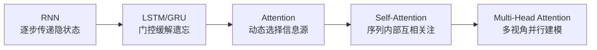
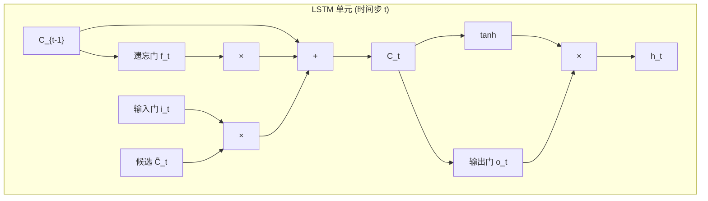
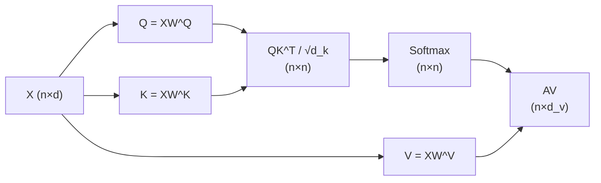
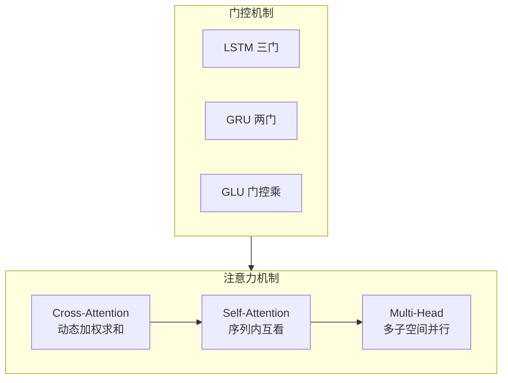

# 注意力机制、序列建模与门控结构学习笔记

**作者**：杨子翔
**日期**：2026-06-28

 **主题**：RNN / LSTM / GRU、注意力机制、自注意力、多头注意力、GLU

---

## 目录

1. [为什么需要序列建模与注意力](#一为什么需要序列建模与注意力)
2. [循环神经网络 RNN](#二循环神经网络-rnn)
3. [LSTM 长短期记忆网络](#三lstm-长短期记忆网络)
4. [GRU 门控循环单元](#四gru-门控循环单元)
5. [注意力机制 Attention Mechanism](#五注意力机制-attention-mechanism)
6. [自注意力机制 Self-Attention](#六自注意力机制-self-attention)
7. [多头注意力 Multi-Head Attention](#七多头注意力-multi-head-attention)
8. [门控线性单元 GLU](#八门控线性单元-glu)
9. [结构对比与联系总结](#九结构对比与联系总结)

---

## 一、为什么需要序列建模与注意力

### 1.1 序列数据的特点

自然语言、语音、时间序列等数据的共同特征是：**元素之间存在顺序与依赖关系**。


| 数据类型 | 序列单元   | 依赖关系示例           |
| ---- | ------ | ---------------- |
| 文本   | 词 / 字符 | "不" + "好" → 否定语义 |
| 语音   | 帧      | 前后音素构成音节         |
| 时间序列 | 时间步    | 今日股价受昨日影响        |


传统前馈网络（MLP、CNN）对输入位置不敏感，难以直接建模"第 1 个词与第 10 个词之间的长距离依赖"。

### 1.2 从 RNN 到 Attention 的演进逻辑




| 阶段             | 核心思想      | 主要局限              |
| -------------- | --------- | ----------------- |
| RNN            | 用隐状态压缩历史  | 梯度消失、难以并行         |
| LSTM/GRU       | 门控控制信息留存  | 仍是串行计算            |
| Attention      | 直接访问任意位置  | 最初用于编码器-解码器对齐     |
| Self-Attention | 序列内两两交互   | 计算复杂度 O(n²)       |
| Multi-Head     | 多个子空间并行关注 | Transformer 的基础模块 |


---


## 二、循环神经网络（RNN）


### 2.1 基本结构

RNN 在每个时间步 $t$ 接收当前输入 $\mathbf{x}*t$ 和上一时刻隐状态 $\mathbf{h}*{t-1}$，输出新的隐状态 $\mathbf{h}_t$：

$$
\mathbf{h}*t = \tanh(\mathbf{W}*{xh}\mathbf{x}*t + \mathbf{W}*{hh}\mathbf{h}_{t-1} + \mathbf{b}_h)
$$

$$
\mathbf{y}*t = \mathbf{W}*{hy}\mathbf{h}_t + \mathbf{b}_y
$$

其中：

- $\mathbf{x}_t \in \mathbb{R}^{d_x}$：第 $t$ 步输入（如词向量）
- $\mathbf{h}_t \in \mathbb{R}^{d_h}$：隐状态，可理解为"对历史的压缩摘要"
- $\mathbf{y}_t$：第 $t$ 步输出（如每个词的分类 logits）

**参数共享**：$\mathbf{W}*{xh}, \mathbf{W}*{hh}, \mathbf{W}_{hy}$ 在所有时间步共享，使模型能处理变长序列。

### 2.2 展开图（Unrolling）

将 RNN 按时间步展开后，等价于一个深层网络，每层对应一个时间步：

```
x₁ → [RNN] → h₁ → y₁
x₂ → [RNN] → h₂ → y₂   （同一组 W 重复使用）
x₃ → [RNN] → h₃ → y₃
```

隐状态 $\mathbf{h}_t$ 理论上携带了 $x_1, x_2, \ldots, x_t$ 的信息，但实践中**远距离信息会被稀释**。

### 2.3 三种常见任务形态


| 类型           | 输入 → 输出  | 示例             |
| ------------ | -------- | -------------- |
| One-to-One   | 单步 → 单步  | 不适用典型 RNN      |
| Many-to-One  | 序列 → 单向量 | 情感分类（整句 → 正/负） |
| Many-to-Many | 序列 → 序列  | 机器翻译、序列标注      |
| One-to-Many  | 单向量 → 序列 | 图像描述生成         |


### 2.4 反向传播：BPTT

RNN 通过**时间反向传播**（Backpropagation Through Time, BPTT）训练。损失对 $\mathbf{W}_{hh}$ 的梯度含连乘项：

$$
\frac{\partial \mathcal{L}}{\partial \mathbf{W}*{hh}} \propto \sum_t \sum*{k=1}^{t} \frac{\partial \mathcal{L}_t}{\partial \mathbf{h}*t}\left(\prod*{j=k+1}^{t} \frac{\partial \mathbf{h}*j}{\partial \mathbf{h}*{j-1}}\right) \frac{\partial \mathbf{h}*k}{\partial \mathbf{W}*{hh}}
$$

当 $\partial \mathbf{h}*j / \partial \mathbf{h}*{j-1} < 1$ 反复连乘时 → **梯度消失**（长程依赖学不到）；
当该范数 $> 1$ 反复连乘时 → **梯度爆炸**（训练不稳定）。

### 2.5 优缺点


| 优势            | 局限                           |
| ------------- | ---------------------------- |
| 天然处理变长序列      | 长序列梯度消失/爆炸                   |
| 参数量不随序列长度线性暴增 | **无法并行**（$h_t$ 依赖 $h_{t-1}$） |
| 结构简单，易于理解     | 隐状态容量有限，难以保留全部历史             |
| 是许多高级模型的基础    | 对远距离依赖建模能力弱                  |


---


## 三、LSTM（长短期记忆网络）


### 3.1 设计动机

LSTM（Hochreiter & Schmidhuber, 1997）通过引入**细胞状态**（Cell State）$\mathbf{C}_t$ 和**三门机制**，让网络学会"记住什么、忘记什么、输出什么"，从结构上缓解梯度消失。

### 3.2 核心公式

LSTM 在每个时间步维护两个状态：隐状态 $\mathbf{h}_t$ 和细胞状态 $\mathbf{C}_t$。

**① 遗忘门（Forget Gate）** — 决定从 $\mathbf{C}_{t-1}$ 中丢弃多少信息：

$$
\mathbf{f}_t = \sigma(\mathbf{W}*f [\mathbf{h}*{t-1}, \mathbf{x}_t] + \mathbf{b}_f)
$$

**② 输入门（Input Gate）** — 决定写入多少新信息：

$$
\mathbf{i}_t = \sigma(\mathbf{W}*i [\mathbf{h}*{t-1}, \mathbf{x}_t] + \mathbf{b}_i)
$$

$$
\tilde{\mathbf{C}}_t = \tanh(\mathbf{W}*C [\mathbf{h}*{t-1}, \mathbf{x}_t] + \mathbf{b}_C)
$$

**③ 更新细胞状态**：

$$
\mathbf{C}_t = \mathbf{f}*t \odot \mathbf{C}*{t-1} + \mathbf{i}_t \odot \tilde{\mathbf{C}}_t
$$

**④ 输出门（Output Gate）** — 决定输出什么：

$$
\mathbf{o}_t = \sigma(\mathbf{W}*o [\mathbf{h}*{t-1}, \mathbf{x}_t] + \mathbf{b}_o)
$$

$$
\mathbf{h}_t = \mathbf{o}_t \odot \tanh(\mathbf{C}_t)
$$

其中 $\sigma$ 为 Sigmoid，$\odot$ 为逐元素乘法（Hadamard 积），$[\cdot,\cdot]$ 表示拼接。

### 3.3 结构示意




### 3.4 为什么 LSTM 能缓解梯度消失

- 细胞状态 $\mathbf{C}_t$ 的更新是**加法**而非连乘：$\mathbf{C}_t = \mathbf{f}*t \odot \mathbf{C}*{t-1} + \cdots$
- 梯度沿 $\mathbf{C}$ 传播时，遗忘门 $\mathbf{f}_t$ 可在接近 1 时使梯度**近似恒等传递**
- 网络可学习"长期保留通道"和"短期更新通道"


### 3.5 优缺点


| 优势                 | 局限                      |
| ------------------ | ----------------------- |
| 擅长捕获长程依赖           | 参数量约为 vanilla RNN 的 4 倍 |
| 缓解梯度消失             | 仍是**串行**计算，训练慢          |
| 工业界长期主流（2014–2017） | 门控结构复杂，调参成本高            |
| 双向 LSTM 可兼顾前后文     | 极长序列仍有信息瓶颈              |


---


## 四、GRU（门控循环单元）


### 4.1 设计动机

GRU（Cho et al., 2014）是 LSTM 的简化版：**合并细胞状态与隐状态**，用 2 个门替代 3 个门，参数更少，效果常与 LSTM 相当。

### 4.2 核心公式

**① 更新门（Update Gate）** — 控制"保留旧状态"与"接受新状态"的比例：

$$
\mathbf{z}_t = \sigma(\mathbf{W}*z [\mathbf{h}*{t-1}, \mathbf{x}_t])
$$

**② 重置门（Reset Gate）** — 控制计算候选状态时"忘记"多少历史：

$$
\mathbf{r}_t = \sigma(\mathbf{W}*r [\mathbf{h}*{t-1}, \mathbf{x}_t])
$$

**③ 候选隐状态**：

$$
\tilde{\mathbf{h}}_t = \tanh(\mathbf{W}_h [\mathbf{r}*t \odot \mathbf{h}*{t-1}, \mathbf{x}_t])
$$

**④ 最终隐状态**（更新门插值）：

$$
\mathbf{h}_t = (1 - \mathbf{z}*t) \odot \mathbf{h}*{t-1} + \mathbf{z}_t \odot \tilde{\mathbf{h}}_t
$$

### 4.3 LSTM vs GRU 对比


| 对比项  | LSTM                            | GRU              |
| ---- | ------------------------------- | ---------------- |
| 门数量  | 3（遗忘/输入/输出）                     | 2（更新/重置）         |
| 状态变量 | $\mathbf{h}_t$ + $\mathbf{C}_t$ | 仅$\mathbf{h}_t$  |
| 参数量  | 较多                              | 较少（约 LSTM 的 75%） |
| 训练速度 | 较慢                              | 通常更快             |
| 长程依赖 | 理论表达力略强                         | 多数任务表现接近         |
| 适用场景 | 极长序列、复杂依赖                       | 资源受限、中等长度序列      |


**直觉理解**：

- LSTM 的遗忘门 ≈ GRU 的 $(1 - \mathbf{z}_t)$
- LSTM 的输入门 � GRU 的 $\mathbf{z}_t$
- GRU 的重置门 $\mathbf{r}_t$ 无直接 LSTM 对应，用于控制历史参与候选状态计算的方式

---


## 五、注意力机制（Attention Mechanism）


### 5.1 核心思想

**Attention 的本质**：不再将整个源序列压缩为一个固定向量，而是让解码器在每一步**动态地、有选择地**关注源序列的不同部分。

> "When translating, you don't read the whole sentence once — you look back at relevant words."


### 5.2  Seq2Seq 中的问题

经典编码器-解码器（Seq2Seq）架构：

```
源句 → [Encoder RNN] → 上下文向量 c → [Decoder RNN] → 目标句
```

**瓶颈**：所有源信息被压缩进**单一**向量 $\mathbf{c}$，长句信息损失严重。

### 5.3 Bahdanau Attention（加性注意力，2015）

解码器在生成第 $t$ 个目标词时，计算对源端每个位置 $j$ 的**注意力分数**：

$$
e_{tj} = \mathbf{v}^\top \tanh(\mathbf{W}*s \mathbf{s}*{t-1} + \mathbf{W}_h \mathbf{h}_j)
$$

**归一化为权重**（Softmax）：

$$
\alpha_{tj} = \frac{\exp(e_{tj})}{\sum_{k=1}^{T_x} \exp(e_{tk})}
$$

**上下文向量**为源隐状态的加权和：

$$
\mathbf{c}*t = \sum*{j=1}^{T_x} \alpha_{tj} \mathbf{h}_j
$$

解码器使用 $\mathbf{c}_t$ 而非固定 $\mathbf{c}$ 来生成输出。

### 5.4 Luong Attention（乘性注意力，2015）

更简洁的打分方式：


| 变体      | 打分公式$e_{tj}$                                                    |
| ------- | --------------------------------------------------------------- |
| Dot     | $\mathbf{s}_t^\top \mathbf{h}_j$                                |
| General | $\mathbf{s}_t^\top \mathbf{W} \mathbf{h}_j$                     |
| Concat  | $\mathbf{v}^\top \tanh(\mathbf{W}[\mathbf{s}_t; \mathbf{h}_j])$ |


### 5.5 统一抽象：Query / Key / Value

现代文献将 Attention 统一为：

$$
\text{Attention}(\mathbf{Q}, \mathbf{K}, \mathbf{V}) = \text{softmax}\left(\frac{\mathbf{Q}\mathbf{K}^\top}{\sqrt{d_k}}\right)\mathbf{V}
$$


| 符号                     | 含义               | Seq2Seq 中对应            |
| ---------------------- | ---------------- | ---------------------- |
| **Query** $\mathbf{Q}$ | "我在找什么？"         | 解码器当前状态$\mathbf{s}_t$  |
| **Key** $\mathbf{K}$   | "我有什么？"          | 编码器各步隐状态$\mathbf{h}_j$ |
| **Value** $\mathbf{V}$ | "实际内容是什么？"       | 通常也是$\mathbf{h}_j$     |
| **Score**              | Query 与 Key 的匹配度 | $e_{tj}$               |
| **Weight** $\alpha$    | 归一化后的关注程度        | Softmax 输出             |


### 5.6 注意力权重的可视化意义

权重 $\alpha_{tj}$ 越大，表示生成第 $t$ 个目标词时越"关注"源句第 $j$ 个词。
机器翻译中常见**对齐**（Alignment）现象：目标词与源词形成软对应关系。

### 5.7 优点


| 优势      | 说明                      |
| ------- | ----------------------- |
| 缓解信息瓶颈  | 不再依赖单一上下文向量             |
| 可解释性    | 注意力权重可视化对齐关系            |
| 改善长序列性能 | 直接访问任意源位置               |
| 通用框架    | 可嵌入 RNN、CNN、Transformer |


---


## 六、自注意力机制（Self-Attention）


### 6.1 与 Cross-Attention 的区别


| 类型                  | Q 来源 | K/V 来源 | 典型场景       |
| ------------------- | ---- | ------ | ---------- |
| **Cross-Attention** | 解码器  | 编码器    | Seq2Seq 解码 |
| **Self-Attention**  | 同一序列 | 同一序列   | 句子内部词与词的关系 |


Self-Attention 中，序列每个位置**既当 Query 也当 Key/Value**，计算序列内部所有位置两两之间的关联。

### 6.2 计算流程（Scaled Dot-Product Self-Attention）

给定输入序列矩阵 $\mathbf{X} \in \mathbb{R}^{n \times d}$（$n$ 为序列长度，$d$ 为嵌入维度）：

**Step 1：线性投影得到 Q、K、V**

$$
\mathbf{Q} = \mathbf{X}\mathbf{W}^Q, \quad \mathbf{K} = \mathbf{X}\mathbf{W}^K, \quad \mathbf{V} = \mathbf{X}\mathbf{W}^V
$$

**Step 2：计算注意力分数矩阵**

$$
\mathbf{S} = \frac{\mathbf{Q}\mathbf{K}^\top}{\sqrt{d_k}} \in \mathbb{R}^{n \times n}
$$

- $\mathbf{S}_{ij}$：位置 $i$ 对位置 $j$ 的关注程度
- 除以 $\sqrt{d_k}$ 是为了防止点积过大导致 Softmax 梯度消失（**Scaled** 的由来）

**Step 3：Softmax 归一化**

$$
\mathbf{A} = \text{softmax}(\mathbf{S}) \quad \text{（按行归一化）}
$$

**Step 4：加权求和 Value**

$$
\mathbf{Z} = \mathbf{A}\mathbf{V} \in \mathbb{R}^{n \times d_v}
$$

### 6.3 Shape 流转示例

设 $n=5$（5 个词），$d=512$，$d_k=d_v=64$：


| 步骤      | 张量                 | Shape    |
| ------- | ------------------ | -------- |
| 输入      | $\mathbf{X}$       | (5, 512) |
| Q, K, V | 投影后                | (5, 64)  |
| 分数      | $\mathbf{QK}^\top$ | (5, 5)   |
| 权重      | $\mathbf{A}$       | (5, 5)   |
| 输出      | $\mathbf{Z}$       | (5, 64)  |





### 6.4 自注意力的语义

Self-Attention 使每个词在编码时**直接融合全句其他词的信息**：

- "The **animal** didn't cross the street because **it** was too tired."→ "it" 的表示会强烈关注 "animal"
- 不依赖 RNN 逐步传递，**一步**建立任意两词之间的联系 → 解决长程依赖。


### 6.5 与 RNN 编码器的对比


| 对比项  | RNN/LSTM 编码器            | Self-Attention 编码器      |
| ---- | ----------------------- | ----------------------- |
| 计算方式 | 串行，$O(n)$ 步             | 并行，一步矩阵运算               |
| 最长路径 | $O(n)$                  | $O(1)$（任意两位置直接相连）       |
| 并行化  | 差                       | 好（GPU 友好）               |
| 复杂度  | 每步$O(d^2)$，共 $O(n d^2)$ | $O(n^2 d)$（序列长度平方）      |
| 位置信息 | 隐含于时间步                  | 需额外 Positional Encoding |
| 代表模型 | BiLSTM                  | Transformer Encoder     |


### 6.6 自注意力论文：Structured Self-Attention

Lin et al. (2017) 提出 **Self-Attentive Sentence Embedding**：

- 对句子做 Self-Attention，得到多个注意力头下的句向量
- 用于情感分析等句子级任务
- 说明 Self-Attention 不依赖 Seq2Seq，可独立作为**句子编码器**

---


## 七、多头注意力（Multi-Head Attention）


### 7.1 动机：为什么要"多头"

单头 Self-Attention 只在一个表示子空间中计算关联。**Multi-Head Attention** 将 Q/K/V 投影到 $h$ 个不同的低维子空间，分别做 Attention，再拼接融合：

> 类似于 CNN 中的多个卷积核，每个头关注不同的语义关系（语法、指代、情感极性等）。


### 7.2 计算公式（Transformer, Vaswani et al., 2017）

给定 $h$ 个头，第 $i$ 个头：

$$
\text{head}_i = \text{Attention}(\mathbf{Q}\mathbf{W}_i^Q, \mathbf{K}\mathbf{W}_i^K, \mathbf{V}\mathbf{W}_i^V)
$$

其中 $\mathbf{W}_i^Q, \mathbf{W}_i^K \in \mathbb{R}^{d \times d_k}$，$\mathbf{W}_i^V \in \mathbb{R}^{d \times d_v}$，通常 $d_k = d_v = d / h$。

**拼接并线性变换**：

$$
\text{MultiHead}(\mathbf{Q}, \mathbf{K}, \mathbf{V}) = \text{Concat}(\text{head}_1, \ldots, \text{head}_h)\mathbf{W}^O
$$

$\mathbf{W}^O \in \mathbb{R}^{hd_v \times d}$ 将多头结果映射回原始维度 $d$。

### 7.3 参数量与计算量

以 $d=512$，$h=8$，$d_k=d_v=64$ 为例：


| 组件                  | 参数量                                |
| ------------------- | ---------------------------------- |
| 每个头的$W^Q, W^K, W^V$ | $3 \times (512 \times 64) = 98304$ |
| 8 个头合计              | $786432$                           |
| 输出投影$W^O$           | $512 \times 512 = 262144$          |
| **总计**              | $\approx 1.05M$                    |


### 7.4 单头 vs 多头


| 对比项  | 单头 Attention | 多头 Attention                |
| ---- | ------------ | --------------------------- |
| 子空间  | 1 个          | $h$ 个并行                     |
| 表达能力 | 有限           | 可捕获多种关系模式                   |
| 可解释性 | 一张权重图        | 每个头可分别可视化                   |
| 典型头数 | —            | 8（BERT-base）、12（BERT-large） |
| 应用   | 简单任务         | Transformer 标配              |


**示例**：BERT 不同头可能分别关注：

- 指代消解（it → animal）
- 相邻词搭配（"New" → "York"）
- 句法依存（动词 → 主语）


### 7.5 Transformer 中的三种 Attention


| 类型                     | Q   | K   | V   | 作用            |
| ---------------------- | --- | --- | --- | ------------- |
| Encoder Self-Attention | 编码器 | 编码器 | 编码器 | 源句内部交互        |
| Decoder Self-Attention | 解码器 | 解码器 | 解码器 | 目标句内部（带 Mask） |
| Cross-Attention        | 解码器 | 编码器 | 编码器 | 解码时看源句        |


---


## 八、门控线性单元（GLU）


### 8.1 设计动机

GLU（Gated Linear Unit, Dauphin et al., 2017）将**门控机制**引入前馈层，让网络动态控制信息流通，思想与 LSTM 的门类似，但用于**卷积/全连接**结构。

论文 *Language Modeling with Gated Convolutional Networks* 证明：GLU + 卷积可在语言建模任务上与 LSTM 竞争，且**更易并行**。

### 8.2 基本公式

给定输入 $\mathbf{x}$，将其线性投影为两部分后做门控：

$$
\text{GLU}(\mathbf{x}) = (\mathbf{x}\mathbf{W} + \mathbf{b}) \odot \sigma(\mathbf{x}\mathbf{V} + \mathbf{c})
$$

- 左支 $\mathbf{x}\mathbf{W} + \mathbf{b}$：**值分支**（Value）
- 右支 $\sigma(\mathbf{x}\mathbf{V} + \mathbf{c})$：**门分支**（Gate），Sigmoid 输出 $(0,1)$ 的"开关"
- $\odot$：逐元素相乘，门控制每个维度有多少信息通过


### 8.3 变体


| 变体         | 公式                                              | 特点                |
| ---------- | ----------------------------------------------- | ----------------- |
| **GLU**    | $(\mathbf{xW}) \odot \sigma(\mathbf{xV})$       | 原始形式              |
| **ReGLU**  | $(\mathbf{xW}) \odot \text{ReLU}(\mathbf{xV})$  | 用 ReLU 替代 Sigmoid |
| **GEGLU**  | $(\mathbf{xW}) \odot \text{GELU}(\mathbf{xV})$  | PaLM、LLaMA 等使用    |
| **SwiGLU** | $(\mathbf{xW}) \odot \text{Swish}(\mathbf{xV})$ | LLaMA、PaLM-2 常用   |


### 8.4 与 LSTM 门控的联系


| 机制              | 门的作用          | 应用位置     |
| --------------- | ------------- | -------- |
| LSTM 遗忘门        | 控制保留多少旧细胞状态   | 循环单元     |
| GRU 更新门         | 控制新旧隐状态插值     | 循环单元     |
| GLU             | 控制每个特征维度通过多少  | 卷积/FFN 层 |
| Transformer FFN | 无显式门（GELU 激活） | 前馈网络     |


**共同点**：都是通过 $[0,1]$ 或类似范围的"软开关"实现**选择性信息传递**。

### 8.5 在 Transformer FFN 中的演进

标准 Transformer FFN：

$$
\text{FFN}(\mathbf{x}) = \text{ReLU}(\mathbf{x}\mathbf{W}_1 + \mathbf{b}_1)\mathbf{W}_2 + \mathbf{b}_2
$$

现代大模型（如 LLaMA）常用 **SwiGLU FFN**：

$$
\text{SwiGLU}(\mathbf{x}) = \big(\text{Swish}(\mathbf{x}\mathbf{W}_1) \odot (\mathbf{x}\mathbf{W}_2)\big)\mathbf{W}_3
$$

将 FFN 中间维度扩展为 $8/3 \times d$ 以补偿 GLU 带来的参数效率变化。

### 8.6 PyTorch 伪代码

```python
class GLU(nn.Module):
    def __init__(self, input_dim, output_dim):
        super().__init__()
        self.fc_value = nn.Linear(input_dim, output_dim)
        self.fc_gate  = nn.Linear(input_dim, output_dim)

    def forward(self, x):
        value = self.fc_value(x)
        gate  = torch.sigmoid(self.fc_gate(x))
        return value * gate
```

---


## 九、结构对比与联系总结


### 9.1 统一视角：信息选择与传递




### 9.2 核心公式对照表


| 模块             | 核心运算                                                                                           | 输出含义   |
| -------------- | ---------------------------------------------------------------------------------------------- | ------ |
| RNN            | $\mathbf{h}_t = f(\mathbf{x}*t, \mathbf{h}*{t-1})$                                             | 历史压缩向量 |
| LSTM           | $\mathbf{C}_t = \mathbf{f}*t \odot \mathbf{C}*{t-1} + \mathbf{i}_t \odot \tilde{\mathbf{C}}_t$ | 门控记忆   |
| GRU            | $\mathbf{h}_t = (1-\mathbf{z}*t)\mathbf{h}*{t-1} + \mathbf{z}_t \tilde{\mathbf{h}}_t$          | 简化门控记忆 |
| Attention      | $\mathbf{c} = \sum_j \alpha_j \mathbf{h}_j$                                                    | 动态上下文  |
| Self-Attention | $\mathbf{Z} = \text{softmax}(\mathbf{QK}^\top/\sqrt{d_k})\mathbf{V}$                           | 全局交互表示 |
| Multi-Head     | $\text{Concat}(\text{head}_1,\ldots,\text{head}_h)\mathbf{W}^O$                                | 多视角融合  |
| GLU            | $(\mathbf{xW}) \odot \sigma(\mathbf{xV})$                                                      | 门控特征变换 |


### 9.3 串行 vs 并行建模


| 模型类型         | 代表                           | 并行性 | 长程依赖        | 典型任务       |
| ------------ | ---------------------------- | --- | ----------- | ---------- |
| 串行           | RNN/LSTM/GRU                 | 差   | 中等（LSTM 较好） | 早期 NLP、语音  |
| 串行+Attention | RNN + Bahdanau Attn          | 差   | 较好          | 机器翻译       |
| 并行           | Self-Attention / Transformer | 好   | 好           | 现代 NLP、多模态 |
| 并行+门控        | Conv + GLU                   | 好   | 受卷积核限制      | 语言建模       |


### 9.4 情感分析任务中的选型建议


| 方案                       | 结构                | 优点         | 缺点           |
| ------------------------ | ----------------- | ---------- | ------------ |
| BiLSTM                   | 双向 LSTM + 池化      | 成熟稳定，参数量适中 | 串行，长句慢       |
| Self-Attentive Embedding | 多头 Self-Attention | 可解释，并行     | $O(n^2)$ 复杂度 |
| BERT / Transformer       | 预训练 + Fine-tune   | 效果最好       | 资源需求大        |


