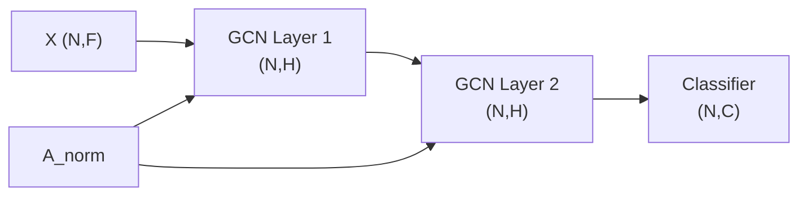

# 图神经网络与图注意力机制学习笔记

**作者**：杨子翔  
**日期**：2026-07-05
**主题**：图神经网络（GNN）、图卷积（GCN）、图注意力（GAT）、过平滑问题

---

## 目录

1. [图的基本概念](#一图的基本概念)
2. [图神经网络 GNN](#二图神经网络-gnn)
3. [图卷积网络 GCN](#三图卷积网络-gcn)
4. [图注意力网络 GAT](#四图注意力网络-gat)
5. [过平滑问题 Over-smoothing](#五过平滑问题-over-smoothing)
6. [GNN 在欺诈检测中的应用](#六gnn-在欺诈检测中的应用)

---

## 一、图的基本概念

### 1.1 图的定义

图 $G = (V, E)$ 由**节点集** $V$ 和**边集** $E$ 组成。在欺诈检测中：
- **节点**：交易记录（或用户、商户）
- **边**：交易之间的关联（同一客户、相似金额/时间、地理邻近等）

### 1.2 邻接矩阵

邻接矩阵 $\mathbf{A} \in \mathbb{R}^{N \times N}$ 描述节点连接关系：

$$
A_{ij} = \begin{cases} 1 & \text{若 } (i,j) \in E \\ 0 & \text{否则} \end{cases}
$$

| 图类型 | 邻接矩阵特点 |
|--------|--------------|
| 无向图 | $\mathbf{A}$ 对称 |
| 有权图 | $A_{ij}$ 为边权重 |
| 自环 | 对角线 $A_{ii} = 1$（常加入以保留自身信息） |

**度矩阵**：$\mathbf{D}_{ii} = \sum_j A_{ij}$

### 1.3 节点特征矩阵

$$
\mathbf{X} \in \mathbb{R}^{N \times F}
$$

$N$ 个节点，每个节点 $F$ 维特征（交易金额、时间、类别编码等）。

### 1.4 图构建方式（欺诈检测）

| 方式 | 说明 | 示例 |
|------|------|------|
| 同实体连边 | 共享信用卡号/用户 | 同一 `cc_num` 的交易互连 |
| kNN 图 | 特征空间近邻 | 金额、时间相似的交易连边 |
| 时序图 | 时间先后 | 同一用户按时间顺序连边 |
| 异构图 | 多种节点类型 | 用户—交易—商户二部图 |

---

## 二、图神经网络 GNN

### 2.1 核心思想

GNN 通过**消息传递**（Message Passing）聚合邻居信息，更新节点表示：

$$
\mathbf{h}_i^{(l+1)} = \text{UPDATE}\Big(\mathbf{h}_i^{(l)},\; \text{AGG}\big(\{\mathbf{h}_j^{(l)} : j \in \mathcal{N}(i)\}\big)\Big)
$$

| 步骤 | 含义 |
|------|------|
| 消息传递 | 邻居节点向 $i$ 发送信息 |
| 聚合 AGG | 对邻居消息求和/均值/最大值 |
| 更新 UPDATE | 结合自身与聚合信息 |

### 2.2 与 CNN、RNN 的对比

| 模型 | 数据结构 | 归纳偏置 |
|------|----------|----------|
| CNN | 网格（图像） | 局部平移不变 |
| RNN | 序列 | 时间顺序 |
| GNN | 图（任意拓扑） | 局部连接 + 置换不变 |

---

## 三、图卷积网络 GCN

### 3.1 Kipf & Welling (2017) 公式

$$
\mathbf{H}^{(l+1)} = \sigma\Big(\tilde{\mathbf{D}}^{-\frac{1}{2}} \tilde{\mathbf{A}} \tilde{\mathbf{D}}^{-\frac{1}{2}} \mathbf{H}^{(l)} \mathbf{W}^{(l)}\Big)
$$

其中 $\tilde{\mathbf{A}} = \mathbf{A} + \mathbf{I}$（加自环），$\tilde{\mathbf{D}}$ 为对应度矩阵。

**对称归一化** $\tilde{\mathbf{D}}^{-1/2}\tilde{\mathbf{A}}\tilde{\mathbf{D}}^{-1/2}$ 防止数值爆炸。

### 3.2 单层 GCN 直觉

每个节点的新表示 = **自身 + 邻居** 特征的加权平均，再线性变换 + 激活。

### 3.3 Shape 流转

| 步骤 | Shape |
|------|-------|
| 输入特征 $\mathbf{X}$ | (N, F) |
| 第 1 层 GCN | (N, H) |
| 第 2 层 GCN | (N, H) |
| 分类头 | (N, 2) |



---

## 四、图注意力网络 GAT

### 4.1 Veličković et al. (2018) 核心公式

**注意力系数**（节点 $j$ 对 $i$ 的重要性）：

$$
e_{ij} = \text{LeakyReLU}\big(\mathbf{a}^\top [\mathbf{W}\mathbf{h}_i \| \mathbf{W}\mathbf{h}_j]\big)
$$

$$
\alpha_{ij} = \frac{\exp(e_{ij})}{\sum_{k \in \mathcal{N}(i)} \exp(e_{ik})}
$$

**节点更新**：

$$
\mathbf{h}_i' = \sigma\Big(\sum_{j \in \mathcal{N}(i)} \alpha_{ij}\, \mathbf{W}\mathbf{h}_j\Big)
$$

### 4.2 GAT vs GCN

| 对比项 | GCN | GAT |
|--------|-----|-----|
| 邻居权重 | 由度归一化固定决定 | **可学习**注意力 $\alpha_{ij}$ |
| 灵活性 | 低 | 高，可区分重要邻居 |
| 计算量 | 较低 | 较高（需算所有邻居注意力） |
| 多头 | 不支持原生 | 支持 Multi-Head Attention |

### 4.3 多头 GAT

$K$ 个头独立计算注意力，拼接或平均：

$$
\mathbf{h}_i' = \|_{k=1}^{K} \sigma\Big(\sum_{j \in \mathcal{N}(i)} \alpha_{ij}^{(k)} \mathbf{W}^{(k)}\mathbf{h}_j\Big)
$$

---

## 五、过平滑问题 Over-smoothing

### 5.1 现象

堆叠过多 GNN 层后，所有节点的表示趋于**相同**，丢失区分能力，分类性能下降。

**原因**：反复聚合邻居 ≈ 反复低通滤波，节点特征收敛到全局均值。

### 5.2 解决方案

| 方法 | 思路 |
|------|------|
| **减少层数** | 2 层 GCN 通常足够 |
| **残差连接** | $\mathbf{H}^{(l+1)} = \mathbf{H}^{(l)} + \text{GNN}(\mathbf{H}^{(l)})$ |
| **Jumping Knowledge** | 拼接各层输出，保留多尺度信息 |
| **PairNorm** | 归一化节点特征方差 |
| **DropEdge** | 随机删边，增加多样性 |
| **GAT** | 注意力机制可抑制无关邻居 |

### 5.3 本实验验证

对比 GCN 层数 1/2/3/4，观察验证集 AUC 随层数变化，验证过平滑效应。

---

## 六、GNN 在欺诈检测中的应用

### 6.1 为什么用 GNN

- 欺诈交易往往在**关系网络**中传播（同一团伙、相似模式）
- 单条交易的 MLP 分类忽略**上下文**
- GNN 可聚合邻居交易信息，捕获"异常子图"模式

### 6.2 典型 Pipeline

```
原始交易 CSV
  → 特征工程（金额、时间、类别、距离…）
  → 构建图（kNN + 同 cc_num）
  → GCN/GAT 节点分类
  → 欺诈概率输出
```

### 6.3 数据不平衡

信用卡欺诈通常 **< 1% 正样本**，需：
- 加权交叉熵：`weight = [1, n_neg/n_pos]`
- 过采样欺诈节点
- 评估用 **AUC-ROC、F1**，而非 Accuracy

---
