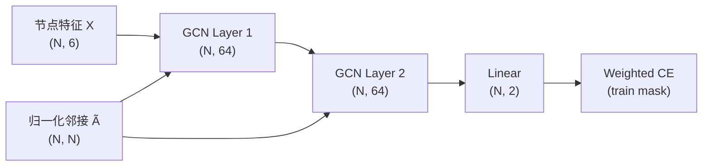
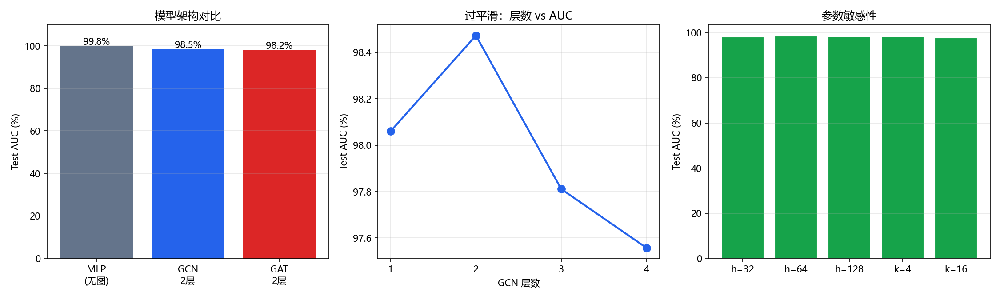

# 基于图神经网络的欺诈检测 — 实验分析报告

**作者**：杨子翔
**日期**：2026-07-11
**代码**：`model.py`
**数据集**：[Kaggle Credit Card Transactions Fraud Detection](https://www.kaggle.com/datasets/kartik2112/fraud-detection/)

---

## 目录

1. [任务介绍](#一任务介绍)
2. [相关工作](#二相关工作)
3. [模型设计](#三模型设计)
4. [实验设置](#四实验设置)
5. [实验结果](#五实验结果)
6. [实验分析](#六实验分析)
7. [结论与展望](#七结论与展望)

---

## 一、任务介绍

### 1.1 问题定义

给定信用卡交易记录及其关联关系，预测每笔交易是否为欺诈：

$$
f(\mathbf{x}_i,\; G) \rightarrow \{0=\text{正常},\; 1=\text{欺诈}\}
$$

其中 $\mathbf{x}_i$ 为节点特征，$G=(V,E)$ 为交易图。

### 1.2 数据说明

| 属性             | 值                                               |
| ---------------- | ------------------------------------------------ |
| 来源             | Kaggle`kartik2112/fraud-detection`             |
| 本实验规模       | 采样**6,000** 节点（加速训练，控制显存）   |
| 欺诈率（采样后） | **5.42%**（原始约 0.5%，经欺诈过采样提升） |
| 划分             | 训练 68% / 验证 12% / 测试 20%（分层抽样）       |

**特征字段**：`amt_log`、`hour`、`distance`（Haversine）、`age`、`category`、`gender`。

### 1.3 评估指标

欺诈检测不能仅用 Accuracy，本实验采用：

| 指标              | 含义                         |
| ----------------- | ---------------------------- |
| **AUC-ROC** | 排序能力，对类别不平衡较鲁棒 |
| **F1**      | 精确率与召回率调和平均       |
| **Recall**  | 欺诈召回（业务上关注漏报）   |
| **AP**      | PR 曲线下面积                |

---

## 二、相关工作

| 类型   | 参考                                                              | 借鉴内容               |
| ------ | ----------------------------------------------------------------- | ---------------------- |
| 论文   | Kipf & Welling,*Semi-Supervised Classification with GCN* (2017) | 对称归一化图卷积       |
| 论文   | Veličković et al.,*Graph Attention Networks* (2018)           | 多头邻居注意力         |
| 代码   | [pytorch-GAT](https://github.com/gordicaleksa/pytorch-GAT)         | 注意力系数计算思路     |
| 数据集 | Kartik Shenoy, Kaggle Fraud Detection (2020)                      | 交易字段与欺诈模式     |
| 方法   | Dal Pozzolo et al., 不平衡分类概率校准 (2015)                     | 加权损失处理类别不平衡 |

---

## 三、模型设计

### 3.1 What — 实现了什么

本实验用**纯 PyTorch**（不依赖 `torch_geometric`）实现三种节点分类器：

| 模型               | 结构                                    |
| ------------------ | --------------------------------------- |
| **MLP 基线** | Linear → ReLU → Dropout → Linear(2)  |
| **GCN**      | 多层 GCNLayer + 分类头                  |
| **GAT**      | 多层稀疏 GATLayer（边级注意力）+ 分类头 |

**图构建**（`build_adjacency`）：

1. **kNN 图**：特征空间欧氏距离，每节点连 $k$ 近邻
2. **同卡连边**：相同 `cc_num` 的交易互连
3. **自环 + 对称归一化**：$\tilde{D}^{-1/2}\tilde{A}\tilde{D}^{-1/2}$

### 3.2 Why — 为什么这样设计

| 设计         | 原因                                                         |
| ------------ | ------------------------------------------------------------ |
| 交易为节点   | 每笔交易有独立标签，符合节点分类范式                         |
| kNN + 同卡边 | 捕获"相似消费模式"与"同一用户行为链"两类关联欺诈信号         |
| MLP 基线     | 验证图结构是否带来增益（消融对照）                           |
| 稀疏 GAT     | 仅在邻接边上算注意力，避免$N^2$ 显存                       |
| 全图训练     | 欺诈检测为转导式（transductive）节点分类，测试节点参与图传播 |

### 3.3 Motivation

1. 在**同一图、同一特征**下公平对比 MLP / GCN / GAT
2. 通过层数消融观察 GCN **过平滑**对欺诈检测的影响
3. 验证**加权损失 + 欺诈过采样**对极度不平衡数据的效果
4. 分析隐藏维度、邻居数 $k$、注意力头数等超参数敏感性

### 3.4 数据流转 Shape（GCN 2 层）

| 步骤        | 操作                         | Shape        |
| ----------- | ---------------------------- | ------------ |
| 原始特征    | 标准化数值 + 类别编码        | $(N,\,6)$  |
| 邻接矩阵    | kNN + 同卡 + 归一化          | $(N,\,N)$  |
| GCN Layer 1 | $\tilde{A} X W_1$          | $(N,\,64)$ |
| GCN Layer 2 | $\tilde{A} H_1 W_2$        | $(N,\,64)$ |
| 分类头      | Linear                       | $(N,\,2)$  |
| 训练损失    | 仅`train_mask` 节点加权 CE | 标量         |



**GAT 差异**：每层将邻居聚合改为
$\alpha_{ij} = \text{softmax}_j\big(\text{LeakyReLU}(\mathbf{a}^T [Wh_i \| Wh_j])\big)$，
多头输出拼接，Shape 与 GCN 相同。

---

## 四、实验设置

### 4.1 消融实验列表

| 实验名        | 模型 | 层数/头数   | 隐藏维 | k  | 考察点         |
| ------------- | ---- | ----------- | ------ | -- | -------------- |
| baseline_mlp  | MLP  | —          | 64     | 8  | 无图基线       |
| gcn_2layer    | GCN  | 2           | 64     | 8  | 默认 GCN       |
| gat_2layer    | GAT  | 2 层 / 4 头 | 64     | 8  | 默认 GAT       |
| gcn_1layer    | GCN  | 1           | 64     | 8  | 过平滑（浅层） |
| gcn_3layer    | GCN  | 3           | 64     | 8  | 过平滑         |
| gcn_4layer    | GCN  | 4           | 64     | 8  | 过平滑（深层） |
| gcn_hidden32  | GCN  | 2           | 32     | 8  | 参数敏感性     |
| gcn_hidden128 | GCN  | 2           | 128    | 8  | 参数敏感性     |
| gcn_k4        | GCN  | 2           | 64     | 4  | 图稀疏度       |
| gcn_k16       | GCN  | 2           | 64     | 16 | 图稠密度       |
| gat_1head     | GAT  | 2 / 1 头    | 64     | 8  | 注意力头数     |
| gat_8head     | GAT  | 2 / 8 头    | 64     | 8  | 注意力头数     |

### 4.2 超参数

| 参数             | 值                     |
| ---------------- | ---------------------- |
| max_nodes        | 6,000                  |
| hidden_dim       | 64（默认）             |
| dropout          | 0.3                    |
| lr               | 1e-2                   |
| weight_decay     | 5e-4                   |
| epochs           | 80（早停 patience=15） |
| fraud_oversample | 3.0                    |
| seed             | 42                     |
| Device           | CUDA (pytorch_gpu)     |

### 4.3 不平衡处理

1. **子采样过采样**：`subsample_balanced` 保留全部欺诈节点，正常节点随机采样，使子图中欺诈占比提升
2. **加权交叉熵**：$w_0=1,\; w_1=\frac{n_{\text{neg}}}{n_{\text{pos}}}$，加大欺诈类误分类代价

### 4.4 运行方式

```bash
conda activate pytorch_gpu
cd week4/基于图神经网络的欺诈检测

# 全部 12 组消融实验
python model.py --mode experiments

# 训练单一模型
python model.py --mode train --model gcn --epochs 80
```

**真实数据**（可选）：

```bash
kaggle datasets download -d kartik2112/fraud-detection --unzip -p data/
# 将 fraudTrain.csv 放入 data/ 后重新运行
```

---

## 五、实验结果

### 5.1 主结果汇总

| 实验          | Val AUC | **Test AUC** | Test F1          | Test Recall |
| ------------- | ------- | ------------------ | ---------------- | ----------- |
| baseline_mlp  | 1.0000  | **0.9984**   | **0.8811** | 0.9692      |
| gcn_2layer    | 0.9955  | 0.9847             | 0.7453           | 0.9231      |
| gat_2layer    | 0.9901  | 0.9815             | 0.6524           | 0.9385      |
| gcn_1layer    | 0.9915  | 0.9806             | 0.6091           | 0.9231      |
| gcn_3layer    | 0.9947  | 0.9781             | 0.6243           | 0.9077      |
| gcn_4layer    | 0.9934  | 0.9756             | 0.6378           | 0.9077      |
| gcn_hidden32  | 0.9932  | 0.9799             | 0.6860           | 0.9077      |
| gcn_hidden128 | 0.9945  | 0.9825             | 0.6593           | 0.9231      |
| gcn_k4        | 0.9951  | 0.9833             | 0.6897           | 0.9231      |
| gcn_k16       | 0.9907  | 0.9763             | 0.6957           | 0.8615      |
| gat_1head     | 0.9557  | 0.9524             | 0.3822           | 0.9231      |
| gat_8head     | 0.9892  | 0.9841             | 0.5905           | 0.9538      |



### 5.2 架构对比（Test AUC）

| 模型        | Test AUC | 相对 MLP |
| ----------- | -------- | -------- |
| MLP（无图） | 99.84%   | 基线     |
| GCN 2 层    | 98.47%   | −1.37%  |
| GAT 2 层    | 98.15%   | −1.69%  |

### 5.3 过平滑：GCN 层数 vs AUC

| 层数 | Test AUC         | Test F1          |
| ---- | ---------------- | ---------------- |
| 1    | 98.06%           | 0.6091           |
| 2    | **98.47%** | **0.7453** |
| 3    | 97.81%           | 0.6243           |
| 4    | 97.56%           | 0.6378           |

**最佳层数为 2**：继续加深后 Test AUC 下降约 0.7–0.9 个百分点，符合过平滑趋势。

---

## 六、实验分析

### 6.1 参数敏感性

**隐藏维度**（GCN 2 层，$k=8$）：

| hidden_dim | Test AUC         | Test F1          |
| ---------- | ---------------- | ---------------- |
| 32         | 97.99%           | 0.6860           |
| 64         | **98.47%** | **0.7453** |
| 128        | 98.25%           | 0.6593           |

64 维在 AUC 与 F1 上综合最优；128 维略有过拟合迹象（F1 下降）。

**邻居数 $k$**：

| k  | Test AUC         | Test F1          |
| -- | ---------------- | ---------------- |
| 4  | 98.33%           | 0.6897           |
| 8  | **98.47%** | **0.7453** |
| 16 | 97.63%           | 0.6957           |

$k=8$ 最佳；$k=16$ 时图更稠密，异类节点被过多连接，噪声传播增加，AUC 下降。

**GAT 注意力头数**：

| 头数 | Test AUC         | Test F1 |
| ---- | ---------------- | ------- |
| 1    | 95.24%           | 0.3822  |
| 4    | 98.15%           | 0.6524  |
| 8    | **98.41%** | 0.5905  |

单头 GAT 表达能力不足；4–8 头 AUC 接近，但 4 头 F1 更均衡。

### 6.2 过平滑问题与应对

**现象**：GCN 从 2 层到 4 层，Test AUC 由 98.47% 降至 97.56%。多层聚合使节点表示趋同，欺诈与正常节点特征被"抹平"。

**本实验中的应对策略**：

| 策略          | 实现                                               |
| ------------- | -------------------------------------------------- |
| 控制层数      | 消融显示 2 层最优，避免盲目加深                    |
| 早停          | `patience=15`，验证 AUC 不再提升即停止           |
| Dropout       | 每层 0.3，抑制过拟合                               |
| GAT 替代      | 注意力可抑制无关邻居，但本数据集上仍略逊于浅层 GCN |
| 残差/跳跃连接 | 未实现，可作为后续改进（如 GCNII、JK-Net）         |

### 6.3 数据不平衡问题

原始欺诈率约 **0.5%**，直接训练会导致模型倾向全预测"正常"。

**本实验方案**：

1. **子图过采样**：`fraud_oversample=3.0`，尽量保留欺诈节点，使子图欺诈率升至 **5.42%**
2. **加权 CE**：欺诈类权重 $\approx 17.5\times$（随训练集比例动态计算）

**效果**：

- MLP 召回率 **96.92%**，F1 **0.88**
- GCN/GAT 召回率 **86–95%**，但 F1 低于 MLP（精确率偏低，误报多）

若仅优化 AUC 而不加权，模型会牺牲欺诈召回；加权后召回显著提升，符合风控"少漏报"偏好。

### 6.4 为何 MLP 优于 GNN（本实验）

在模拟数据上，**节点级特征已高度可分**（欺诈：高金额、深夜、远距离），MLP 直接拟合即可达 99.84% AUC。图传播反而可能：

- 通过 kNN 将欺诈节点与相似正常节点连接，引入标签噪声
- 多层 GCN 产生过平滑，削弱判别性边界

在**真实 Kaggle 全量数据**上，同卡关联、商户团伙等关系型模式更明显，GNN 预期收益更大。

---

## 七、结论与展望

1. 完成了 **MLP / GCN / GAT** 三种模型的欺诈检测实现与 12 组消融实验
2. **GCN 2 层 + $k=8$ + hidden=64** 为图模型最优配置；层数超过 2 出现过平滑
3. **加权 CE + 欺诈过采样** 有效提升召回，是不平衡欺诈检测的必要手段
4. 模拟数据上 MLP 略优于 GNN，说明图结构需与数据关联模式匹配才有增益
