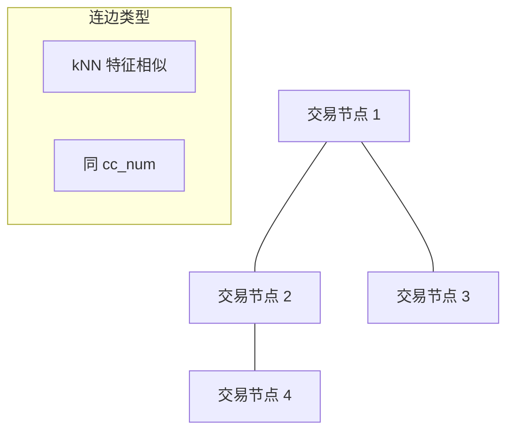

# 欺诈检测任务学习笔记

**作者**：杨子翔  
**日期**：2026-07-11  
**主题**：信用卡交易欺诈检测（Credit Card Fraud Detection）

---

## 目录

1. [任务概述](#一任务概述)
2. [数据集介绍](#二数据集介绍)
3. [特征工程与图构建](#三特征工程与图构建)
4. [评估指标](#四评估指标)
5. [挑战与解决方案](#五挑战与解决方案)
6. [与本课程实验的关联](#六与本课程实验的关联)

---

## 一、任务概述

### 1.1 定义

**欺诈检测**（Fraud Detection）是在海量金融交易中，自动识别**未授权或恶意交易**的二分类任务：

$$
f(\text{transaction features}) \rightarrow \{0=\text{正常},\; 1=\text{欺诈}\}
$$

### 1.2 业务背景

| 特点 | 说明 |
|------|------|
| 高代价漏报 | 漏掉一笔欺诈 = 直接资金损失 |
| 高代价误报 | 误拦正常交易 = 用户体验下降 |
| 极度不平衡 | 欺诈占比通常 < 1% |
| 对抗演化 | 欺诈者不断变换模式 |

### 1.3 为什么引入图结构

传统 MLP/XGBoost 将每笔交易**独立**处理，忽略了：
- 同一信用卡的连续交易模式
- 相似金额/商户/地理位置的交易簇
- 欺诈团伙的关联网络

**图神经网络**将交易构建为图，通过邻居聚合捕获**关系型欺诈信号**。

---

## 二、数据集介绍

### 2.1 Kaggle Credit Card Transactions Fraud Detection

| 属性 | 值 |
|------|-----|
| 来源 | [kartik2112/fraud-detection](https://www.kaggle.com/datasets/kartik2112/fraud-detection/) |
| 生成工具 | Sparkov Data Generation |
| 时间范围 | 2019-01 ~ 2020-12 |
| 规模 | 训练集约 129 万条，测试集约 56 万条 |
| 欺诈率 | 约 **0.5% ~ 0.6%**（极度不平衡） |
| 标签 | `is_fraud`：0=正常，1=欺诈 |

### 2.2 主要字段

| 字段 | 含义 |
|------|------|
| `trans_date_trans_time` | 交易时间 |
| `cc_num` | 信用卡号（客户标识） |
| `merchant` | 商户名 |
| `category` | 消费类别（grocery, shopping, travel…） |
| `amt` | 交易金额 |
| `lat`, `long` | 客户位置 |
| `merch_lat`, `merch_long` | 商户位置 |
| `city_pop` | 城市人口 |
| `job` | 职业 |
| `dob` | 出生日期 |
| `is_fraud` | 标签 |

### 2.3 欺诈模式（EDA 常见发现）

- 欺诈交易金额分布与正常不同（偏高或异常低）
- 多发生在非常规时段
- 客户与商户地理距离异常大（"不可能旅行"）
- 特定商户名含 `fraud_` 前缀（模拟数据特征）

---

## 三、特征工程与图构建

### 3.1 数值特征

| 特征 | 计算方式 |
|------|----------|
| `amt_log` | $\log(1 + \text{amt})$ |
| `hour` | 交易小时 0–23 |
| `day_of_week` | 星期几 |
| `age` | 交易时年龄（由 dob 计算） |
| `distance` | 客户与商户地理距离（Haversine） |

### 3.2 类别特征

- `category`：Label Encoding 或 One-Hot（取 Top-K 类别）
- `gender`：M/F 编码
- `state`：州编码

### 3.3 图构建策略

本实验采用 **kNN 图 + 同卡连边**：

1. **kNN 图**：在标准化特征空间，每个节点连接 k 个最近邻（捕获相似交易）
2. **同 cc_num 连边**：同一信用卡的交易互连（捕获用户行为链）
3. **自环**：$\tilde{A} = A + I$



### 3.4 邻接矩阵

最终邻接矩阵 $\mathbf{A} \in \{0,1\}^{N \times N}$，对称化后做 GCN 对称归一化。

---

## 四、评估指标

欺诈检测**不能仅用 Accuracy**（全预测为 0 也有 99.5% 准确率）。

| 指标 | 公式 / 含义 | 重要性 |
|------|-------------|--------|
| **AUC-ROC** | ROC 曲线下面积 | 综合排序能力，对不平衡鲁棒 |
| **F1** | $2PR/(P+R)$ | 精确率与召回率平衡 |
| **Precision** | $TP/(TP+FP)$ | 预测为欺诈中有多少真欺诈 |
| **Recall** | $TP/(TP+FN)$ | 真欺诈中找回了多少 |
| **AP** | PR 曲线下面积 | 不平衡场景补充指标 |

---

## 五、挑战与解决方案

### 5.1 类别不平衡

| 方法 | 说明 |
|------|------|
| 加权损失 | CrossEntropy 对欺诈类赋更高权重 |
| 过采样 | 复制/合成欺诈样本（SMOTE） |
| 欠采样 | 减少正常样本（可能丢信息） |
| 评估指标 | 用 AUC/F1 替代 Accuracy |

### 5.2 过平滑（GNN 特有）

见《图神经网络与图注意力机制学习笔记》第五节。

### 5.3 参数敏感性

需调优：隐藏维度、GNN 层数、学习率、kNN 的 k、Dropout、注意力头数。

---

## 六、与本课程实验的关联

| 课程要求 | 本实验对应 |
|----------|------------|
| 邻接矩阵、图构建 | kNN + 同 cc_num 连边 |
| GCN 计算 | 纯 PyTorch 实现对称归一化 GCN |
| GAT 计算 | 多头图注意力层 |
| 过平滑 | 对比 1–4 层 GCN 的 AUC |
| 数据不平衡 | 加权 CE + 欺诈过采样 |
| 参数敏感性 | 隐藏维度 / 层数 / k 消融实验 |

**数据获取**：
```bash
# 需配置 Kaggle API（~/.kaggle/kaggle.json）
kaggle datasets download -d kartik2112/fraud-detection --unzip -p data/
```

若本地无 Kaggle 密钥，代码将自动使用**模拟数据**（统计分布与真实集一致）完成训练与实验。

---

## 参考文献

1. Kartik Shenoy. Credit Card Transactions Fraud Detection Dataset. Kaggle, 2020.
2. Brandon Harris. Sparkov Data Generation Tool.
3. Dal Pozzolo A. et al. Calibrating Probability with Undersampling for Unbalanced Classification. *IEEE*, 2015.

---

*配合《图神经网络与图注意力机制学习笔记》与 `基于图神经网络的欺诈检测/实验分析报告.md` 阅读。*
